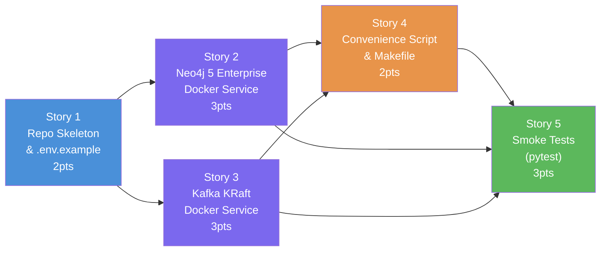

# Slice 1: Reproducible Local Development Environment — User Stories

## Slice Summary

**Parent Phase:** Phase 1 — Foundation & Infrastructure
**Parent Slice:** Slice 1 — Reproducible Local Development Environment

**Slice Goal:** Deliver a single-command (`docker compose up`) local development stack consisting of Neo4j 5 Enterprise and a Kafka broker (KRaft mode, no Zookeeper), complete with health checks, environment variable documentation, and a developer convenience script. This slice has no code dependencies — it is the first thing that lands in the repository.

**Technology Stack involved in this slice:**
- **Docker / Docker Compose v2** — container runtime and multi-service orchestration
- **Neo4j 5.x Enterprise** — graph database (`neo4j:5-enterprise` Docker image)
- **Confluent Community Kafka** (`confluentinc/cp-kafka:7.7.0`) — Kafka broker in KRaft mode (no Zookeeper)
- **Shell / Makefile** — developer convenience wrapper
- **pytest + testcontainers-python** — for the smoke-test story

**Existing source files relevant to this slice:** None — clean repository.

---

## Story 1: Repository Skeleton & Environment Variable Contract

**As a** Developer,
**I want** a minimal but complete repository directory structure and an `.env.example` file documenting every environment variable,
**So that** any team member can clone the repo and immediately understand what configuration is required before running anything.

### Technical Context

**Files to create:**
```
j:\Graph Loader\
├── .env.example
├── .gitignore
├── config/                  (empty dir with .gitkeep)
├── src/                     (empty dir with .gitkeep)
├── tests/                   (empty dir with .gitkeep)
├── scripts/                 (empty dir with .gitkeep)
└── README.md                (already exists — do not overwrite)
```

**`.env.example` must document these variables exactly:**
```dotenv
# Neo4j connection
NEO4J_URI=bolt://localhost:7687
NEO4J_USERNAME=neo4j
NEO4J_PASSWORD=changeme          # REQUIRED: min 8 characters for Neo4j Enterprise
NEO4J_DATABASE=neo4j
NEO4J_ACCEPT_LICENSE_AGREEMENT=yes

# Kafka connection
KAFKA_BOOTSTRAP_SERVERS=localhost:9092
KAFKA_CONSUMER_GROUP_PREFIX=graph-loader

# Loading settings
LOADER_LOG_LEVEL=INFO
```

**`.gitignore` must include:**
```
.env
__pycache__/
*.pyc
*.pyo
.pytest_cache/
.mypy_cache/
dist/
build/
*.egg-info/
.venv/
venv/
```

**No Python code is written in this story.** This is pure repository scaffolding.

### Acceptance Criteria
- [ ] `.env.example` exists and documents all 9 variables above with inline comments.
- [ ] `.gitignore` excludes `.env` (the real secrets file), Python caches, and virtualenv dirs.
- [ ] Directory structure (`config/`, `src/`, `tests/`, `scripts/`) exists with `.gitkeep` placeholders.
- [ ] `git status` on a fresh clone shows a clean, expected file tree.

### Definition of Done
- [ ] Code written and committed.
- [ ] No `.env` file with real secrets committed (verified via `git ls-files | grep -v example`).
- [ ] Technical docs / docstrings updated.
- [ ] Reviewed and merged.

### Dependencies
- Depends on: none
- Blocks: Story 2, Story 3, Story 4

### Estimated Points
**2**

---

## Story 2: Neo4j 5 Enterprise Docker Service

**As a** Data Engineer,
**I want** a `docker-compose.yaml` that starts a fully configured Neo4j 5 Enterprise container with correct memory settings, authentication, and license acceptance,
**So that** I have a production-equivalent Neo4j instance locally that supports concurrent transactions and APOC.

### Technical Context

**File to create:** `j:\Graph Loader\docker-compose.yaml`

**Neo4j service specification:**
```yaml
services:
  neo4j:
    image: neo4j:5-enterprise
    container_name: graph-loader-neo4j
    ports:
      - "7474:7474"   # Neo4j Browser (HTTP)
      - "7687:7687"   # Bolt protocol (driver connections)
    environment:
      NEO4J_AUTH: "${NEO4J_USERNAME:-neo4j}/${NEO4J_PASSWORD}"
      NEO4J_ACCEPT_LICENSE_AGREEMENT: "${NEO4J_ACCEPT_LICENSE_AGREEMENT:-yes}"
      NEO4J_server_memory_heap_initial__size: "512m"
      NEO4J_server_memory_heap_max__size: "2G"
      NEO4J_dbms_memory_pagecache__size: "1G"     # NB: page cache is under dbms.*, not server.*
      NEO4J_dbms_security_procedures_unrestricted: "apoc.*"
      NEO4J_dbms_security_procedures_allowlist: "apoc.*"
      NEO4J_PLUGINS: '["apoc"]'    # auto-install APOC plugin
    volumes:
      - neo4j_data:/data
      - neo4j_logs:/logs
    healthcheck:
      test: ["CMD", "wget", "-q", "--spider", "http://localhost:7474"]
      interval: 10s
      timeout: 5s
      retries: 10
      start_period: 30s
    networks:
      - graph-loader-net
```

**Key decisions documented in code comments:**
- `NEO4J_PLUGINS: '["apoc"]'` — APOC is required by the deadlock prevention strategy (`apoc.lock.nodes()`). Must be installed from the start.
- Enterprise edition is required for `CALL IN CONCURRENT TRANSACTIONS` optimal performance and for `READ_COMMITTED` + write lock optimizations.
- Memory settings: 512m initial heap, 2G max heap, 1G page cache — sufficient for local dev with datasets up to ~10M nodes.

**Edge cases to handle:**
- If `NEO4J_PASSWORD` is not set in `.env`, the container will fail with an auth error. The health check catches this within the `retries` window.
- APOC plugin auto-install requires internet on first pull; document this in a comment.

### Acceptance Criteria
- [ ] `docker compose up -d neo4j` starts the Neo4j container without errors.
- [ ] `docker compose ps` shows neo4j as `healthy` within 60 seconds.
- [ ] Neo4j Browser is accessible at `http://localhost:7474`.
- [ ] APOC is installed: `RETURN apoc.version()` in Neo4j Browser returns a version string.
- [ ] `NEO4J_PLUGINS: '["apoc"]'` is present in the compose file — verified in code review.

### Definition of Done
- [ ] Code written and committed.
- [ ] Manual verification: APOC available, browser accessible.
- [ ] Technical docs / docstrings updated.
- [ ] Reviewed and merged.

### Dependencies
- Depends on: Story 1 (repo skeleton, `.env.example`)
- Blocks: Story 4 (full compose stack), Story 5 (smoke test)

### Estimated Points
**3**

---

## Story 3: Kafka Broker Docker Service (KRaft Mode)

**As a** Data Engineer,
**I want** a Kafka broker added to `docker-compose.yaml` running in KRaft mode (no Zookeeper),
**So that** I have a single-node, low-overhead Kafka environment for local development that mirrors modern production Kafka setups.

### Technical Context

**File to modify:** `j:\Graph Loader\docker-compose.yaml` (add Kafka service alongside Neo4j)

**Kafka service specification:**
```yaml
  kafka:
    image: confluentinc/cp-kafka:7.7.0
    container_name: graph-loader-kafka
    ports:
      - "9092:9092"       # External listener (for Python consumers on host)
      - "9101:9101"       # JMX (optional, for monitoring)
    environment:
      KAFKA_NODE_ID: 1
      KAFKA_PROCESS_ROLES: broker,controller
      KAFKA_CONTROLLER_QUORUM_VOTERS: "1@kafka:29093"
      KAFKA_LISTENERS: "PLAINTEXT://0.0.0.0:9092,CONTROLLER://0.0.0.0:29093,INTERNAL://0.0.0.0:29092"
      KAFKA_ADVERTISED_LISTENERS: "PLAINTEXT://localhost:9092,INTERNAL://kafka:29092"
      KAFKA_LISTENER_SECURITY_PROTOCOL_MAP: "PLAINTEXT:PLAINTEXT,CONTROLLER:PLAINTEXT,INTERNAL:PLAINTEXT"
      KAFKA_INTER_BROKER_LISTENER_NAME: INTERNAL
      KAFKA_CONTROLLER_LISTENER_NAMES: CONTROLLER
      KAFKA_OFFSETS_TOPIC_REPLICATION_FACTOR: 1
      KAFKA_TRANSACTION_STATE_LOG_REPLICATION_FACTOR: 1
      KAFKA_TRANSACTION_STATE_LOG_MIN_ISR: 1
      KAFKA_AUTO_CREATE_TOPICS_ENABLE: "true"
      CLUSTER_ID: "MkU3OEVBNTcwNTJENDM2Qk"   # MUST be a Base64-encoded UUID (22 chars). Generated via: kafka-storage random-uuid. Do NOT use a human-readable string — Kafka will fail to start.
    volumes:
      - kafka_data:/var/lib/kafka/data
    healthcheck:
      test: ["CMD", "kafka-broker-api-versions", "--bootstrap-server", "localhost:9092"]
      interval: 10s
      timeout: 10s
      retries: 10
      start_period: 30s
    networks:
      - graph-loader-net
```

**Also add to `docker-compose.yaml`:**
```yaml
volumes:
  neo4j_data:
  neo4j_logs:
  kafka_data:

networks:
  graph-loader-net:
    driver: bridge
```

**Key decisions:**
- `PLAINTEXT://localhost:9092` — advertised for host-machine Python consumers.
- `INTERNAL://kafka:29092` — used for inter-container communication (loaders connecting to Kafka by container name).
- `CLUSTER_ID: "MkU3OEVBNTcwNTJENDM2Qk"` — must be a **Base64-encoded UUID** (22 chars), generated via `kafka-storage random-uuid`. Hard-coded for reproducibility. Do NOT substitute a human-readable string — Kafka will reject it.
- `KAFKA_AUTO_CREATE_TOPICS_ENABLE: true` — simplifies local dev; loaders don't need to pre-create topics.

**Edge cases:**
- KRaft requires `CLUSTER_ID` to be set; if omitted, Kafka 7.x will fail silently. Document in a comment.
- `kafka-broker-api-versions` healthcheck is more reliable than `kafka-topics.sh` for KRaft mode.

### Acceptance Criteria
- [ ] `docker compose up -d kafka` starts the Kafka container without errors.
- [ ] `docker compose ps` shows kafka as `healthy` within 60 seconds.
- [ ] A test topic can be created: `docker exec graph-loader-kafka kafka-topics --bootstrap-server localhost:9092 --create --topic test.topic --partitions 3 --replication-factor 1`.
- [ ] The topic is visible: `docker exec graph-loader-kafka kafka-topics --bootstrap-server localhost:9092 --list`.
- [ ] Host-machine Python can connect: `confluent_kafka.Consumer({'bootstrap.servers': 'localhost:9092', 'group.id': 'test'})` without exception.

### Definition of Done
- [ ] Code written and committed.
- [ ] Manual verification: topic created and listed successfully.
- [ ] Technical docs / docstrings updated.
- [ ] Reviewed and merged.

### Dependencies
- Depends on: Story 1 (repo skeleton)
- Blocks: Story 4 (full stack), Story 5 (smoke test)

### Estimated Points
**3**

---

## Story 4: Developer Convenience Script & Full Stack Validation

**As a** Developer,
**I want** a `scripts/start_dev.sh` convenience script (and a `Makefile` target) that starts the full stack and waits until both services are confirmed healthy,
**So that** I can start the entire environment with one command and be certain it is ready before running any code.

### Technical Context

**Files to create:**
- `j:\Graph Loader\scripts\start_dev.sh`  — for Git Bash / WSL / Linux / macOS
- `j:\Graph Loader\scripts\start_dev.ps1` — for Windows PowerShell (native, no WSL required)
- `j:\Graph Loader\Makefile`

**`scripts/start_dev.sh`:**
```bash
#!/usr/bin/env bash
# Requires Git Bash or WSL on Windows. See scripts/start_dev.ps1 for PowerShell equivalent.
set -euo pipefail

# REQUIRED: .env must exist with NEO4J_PASSWORD set.
if [ ! -f .env ]; then
  echo "Warning: .env not found. Copy .env.example to .env and set NEO4J_PASSWORD."
  exit 1
fi
export $(grep -v '^#' .env | xargs)

echo "Starting Graph Loader dev stack..."
docker compose up -d

echo "Waiting for Neo4j to be healthy..."
timeout 120 bash -c 'until docker inspect graph-loader-neo4j --format="{{.State.Health.Status}}" 2>/dev/null | grep -q "healthy"; do sleep 3; echo " ...waiting for Neo4j"; done'
echo "Neo4j is ready."

echo "Waiting for Kafka to be healthy..."
timeout 120 bash -c 'until docker inspect graph-loader-kafka --format="{{.State.Health.Status}}" 2>/dev/null | grep -q "healthy"; do sleep 3; echo " ...waiting for Kafka"; done'
echo "Kafka is ready."

echo ""
echo "Dev stack is up:"
echo "  Neo4j Browser : http://localhost:7474"
echo "  Neo4j Bolt    : bolt://localhost:7687"
echo "  Kafka         : localhost:9092"
```

**`Makefile`:**
```makefile
.PHONY: dev dev-down dev-logs

dev:
	@bash scripts/start_dev.sh

dev-down:
	docker compose down -v

dev-logs:
	docker compose logs -f
```

**`scripts/start_dev.ps1`** (Windows PowerShell — no WSL required):
```powershell
# Windows PowerShell equivalent of start_dev.sh
# Requires Docker Desktop for Windows with Docker Compose v2.

if (-not (Test-Path ".env")) {
    Write-Error "Warning: .env not found. Copy .env.example to .env and set NEO4J_PASSWORD."
    exit 1
}

Write-Host "Starting Graph Loader dev stack..."
docker compose up -d

Write-Host "Waiting for Neo4j to be healthy..."
$timeout = 120; $elapsed = 0
while ($elapsed -lt $timeout) {
    $status = docker inspect graph-loader-neo4j --format='{{.State.Health.Status}}' 2>$null  # single quotes: Go template braces must not be expanded by PowerShell
    if ($status -eq "healthy") { break }
    Start-Sleep -Seconds 3; $elapsed += 3; Write-Host "  ...waiting for Neo4j"
}
if ($elapsed -ge $timeout) { Write-Error "Neo4j did not become healthy in time."; exit 1 }
Write-Host "Neo4j is ready."

Write-Host "Waiting for Kafka to be healthy..."
$elapsed = 0
while ($elapsed -lt $timeout) {
    $status = docker inspect graph-loader-kafka --format='{{.State.Health.Status}}' 2>$null  # single quotes required
    if ($status -eq "healthy") { break }
    Start-Sleep -Seconds 3; $elapsed += 3; Write-Host "  ...waiting for Kafka"
}
if ($elapsed -ge $timeout) { Write-Error "Kafka did not become healthy in time."; exit 1 }
Write-Host "Kafka is ready."

Write-Host "`nDev stack is up:"
Write-Host "  Neo4j Browser : http://localhost:7474"
Write-Host "  Neo4j Bolt    : bolt://localhost:7687"
Write-Host "  Kafka         : localhost:9092"
```

**Edge cases:**
- If `.env` does not exist (fresh clone), both scripts exit with code 1 and a clear message. ✅ Implemented.
- `timeout 120` / PS1 loop ensures scripts fail fast if Docker is broken rather than looping forever.

### Acceptance Criteria
- [ ] `bash scripts/start_dev.sh` (or `make dev`) starts both services and prints the endpoint URLs on Linux/macOS/WSL.
- [ ] `powershell scripts/start_dev.ps1` starts both services on Windows PowerShell without WSL.
- [ ] Both scripts exit with code 0 only when both containers report `healthy`.
- [ ] Both scripts exit with code 1 and a clear message if `.env` is missing.
- [ ] `make dev-down` stops and removes containers and volumes cleanly.
- [ ] Running either script twice (stack already up) is idempotent and does not error.

### Definition of Done
- [ ] Code written and committed.
- [ ] `scripts/start_dev.sh` is executable (`chmod +x`).
- [ ] `scripts/start_dev.ps1` tested on Windows PowerShell.
- [ ] Manual end-to-end test: fresh clone → copy `.env.example` to `.env` → run appropriate start script → both services healthy.
- [ ] Reviewed and merged.

### Dependencies
- Depends on: Story 2 (Neo4j service), Story 3 (Kafka service)
- Blocks: Story 5 (smoke test)

### Estimated Points
**2**

---

## Story 5: Automated Environment Smoke Test

**As a** Developer,
**I want** an automated pytest smoke test that programmatically verifies both Neo4j and Kafka are reachable and healthy,
**So that** CI pipelines can confirm the dev environment is correctly configured without manual steps.

### Technical Context

**File to create:** `j:\Graph Loader\tests\test_dev_environment.py`

**Python dependencies required (add to `requirements.txt`):**
```
pytest>=8.0
testcontainers[neo4j,kafka]>=4.8
neo4j>=5.20
confluent-kafka>=2.5
```

**Test implementation:**
```python
"""
Smoke tests for the local development environment.

These tests verify that Neo4j and Kafka containers defined in docker-compose.yaml
are reachable and healthy. They require the stack to already be running
(`make dev` or `docker compose up -d`).

Run with: pytest tests/test_dev_environment.py -v -m smoke
"""
import os
import pytest
from neo4j import GraphDatabase
from confluent_kafka.admin import AdminClient
from confluent_kafka import KafkaException


NEO4J_URI = os.environ.get("NEO4J_URI", "bolt://localhost:7687")
NEO4J_AUTH = ("neo4j", os.environ.get("NEO4J_PASSWORD", "changeme"))  # reads NEO4J_PASSWORD from env
KAFKA_BOOTSTRAP = os.environ.get("KAFKA_BOOTSTRAP_SERVERS", "localhost:9092")


@pytest.mark.smoke
class TestNeo4jConnectivity:
    def test_neo4j_is_reachable(self):
        """Verify Neo4j Bolt endpoint accepts connections."""
        driver = GraphDatabase.driver(NEO4J_URI, auth=NEO4J_AUTH)
        with driver.session() as session:
            result = session.run("RETURN 1 AS n")
            assert result.single()["n"] == 1
        driver.close()

    def test_apoc_is_installed(self):
        """Verify APOC plugin is installed — required for apoc.lock.nodes().
        
        When APOC is missing, apoc.version() raises ClientError (not returns None),
        so we wrap in try/except to produce an actionable failure message.
        """
        driver = GraphDatabase.driver(NEO4J_URI, auth=NEO4J_AUTH)
        try:
            with driver.session() as session:
                result = session.run("RETURN apoc.version() AS version")
                version = result.single()["version"]
                assert version is not None and len(version) > 0, \
                    "APOC returned empty version. Check NEO4J_PLUGINS in docker-compose.yaml"
        except Exception as e:
            pytest.fail(
                f"APOC is not installed or not reachable. "
                f"Add NEO4J_PLUGINS=['apoc'] to docker-compose.yaml. "
                f"Original error: {e}"
            )
        finally:
            driver.close()


@pytest.mark.smoke
class TestKafkaConnectivity:
    def test_kafka_is_reachable(self):
        """Verify Kafka broker accepts AdminClient connections."""
        admin = AdminClient({"bootstrap.servers": KAFKA_BOOTSTRAP})
        metadata = admin.list_topics(timeout=10)
        assert metadata is not None, "Kafka broker did not return metadata"

    def test_kafka_can_create_and_delete_topic(self):
        """Verify Kafka allows topic creation — required for loader topics."""
        from confluent_kafka.admin import NewTopic
        admin = AdminClient({"bootstrap.servers": KAFKA_BOOTSTRAP})
        topic_name = "graph-loader-smoke-test-topic"

        # Create
        futures = admin.create_topics([NewTopic(topic_name, num_partitions=1, replication_factor=1)])
        for topic, f in futures.items():
            try:
                f.result()
            except KafkaException as e:
                if "already exists" not in str(e):
                    raise

        # Verify exists
        metadata = admin.list_topics(timeout=5)
        assert topic_name in metadata.topics

        # Clean up
        admin.delete_topics([topic_name])
```

**`pytest.ini` or `pyproject.toml` marker registration:**
```toml
[tool.pytest.ini_options]
markers = [
    "smoke: environment smoke tests (require docker compose up)",
]
```

**Running the smoke tests:**
```bash
# Requires dev stack to be running first:
make dev
pytest tests/test_dev_environment.py -v -m smoke
```

**Edge cases:**
- If Neo4j password in `.env` differs from the hardcoded default, test must read from `os.environ.get("NEO4J_PASSWORD", "changeme")`.
- APOC check catches the most common setup error: forgetting `NEO4J_PLUGINS` in compose.

### Acceptance Criteria
- [ ] `pytest tests/test_dev_environment.py -v -m smoke` passes with 4 tests when the dev stack is running.
- [ ] `test_apoc_is_installed` specifically validates APOC availability — not just connectivity.
- [ ] `test_kafka_can_create_and_delete_topic` cleans up after itself (no leftover test topics).
- [ ] Tests fail with a clear, actionable error message when the stack is not running.
- [ ] `requirements.txt` is updated with all test dependencies.

### Definition of Done
- [ ] Code written and committed.
- [ ] All 4 smoke tests pass against the running dev stack.
- [ ] `requirements.txt` updated.
- [ ] `pyproject.toml` or `pytest.ini` updated with `smoke` marker registration.
- [ ] Reviewed and merged.

### Dependencies
- Depends on: Story 2 (Neo4j service), Story 3 (Kafka service), Story 4 (full stack scripts)
- Blocks: Slice 2 (YAML Schema Registry — needs a running environment for tests)

### Estimated Points
**3**

---

## Story Map



**Implementation order:** ST1 → ST2 + ST3 → ST4 → ST5

> ⚠️ **Parallelism note (Issue A):** Stories 2 and 3 both write to `docker-compose.yaml`. If assigned to **two developers in parallel**, they will produce a merge conflict on that file. Safe options: (a) assign both to the **same developer sequentially** (ST2 then ST3) in a single PR, or (b) merge ST2 first and have the ST3 developer branch from the merged state. The story map shows them as theoretically parallel in terms of knowledge dependencies only.

---

## Total Estimate

| Story | Name | Points |
|---|---|---|
| 1 | Repo Skeleton & Environment Variable Contract | 2 |
| 2 | Neo4j 5 Enterprise Docker Service | 3 |
| 3 | Kafka Broker Docker Service (KRaft Mode) | 3 |
| 4 | Developer Convenience Script & Full Stack Validation | 2 |
| 5 | Automated Environment Smoke Test | 3 |
| **Total** | | **13 points** |

**Sprint estimate:** 13 points ÷ 30 points/sprint = **~0.5 sprint** (approximately 1 week solo, or 2–3 days with a two-person team taking advantage of the ST2/ST3 parallel track).

**No story exceeds 8 points** — no splitting required.

---

## Open Questions / Ambiguities for Product Owner

1. **Neo4j password source:** The smoke test reads `NEO4J_PASSWORD` from env with a fallback of `"changeme"`. Should the dev stack ship with a fixed well-known dev password documented in `.env.example`, or should the team always be required to copy and edit `.env` before running? (Recommendation: require `.env` to be set — avoids accidental credential habits.)
2. **Windows compatibility:** ✅ **RESOLVED** — `scripts/start_dev.ps1` has been added to Story 4 scope. Both Bash and PowerShell scripts are required deliverables. Git Bash / WSL is NOT required on Windows.
3. **APOC version pinning:** `NEO4J_PLUGINS: '["apoc"]'` installs the latest APOC compatible with the Neo4j version. Should a specific APOC version be pinned? (Recommendation: let Neo4j auto-select the compatible version to reduce maintenance overhead.)

**First Mate should start with:** Story 1 (Repo Skeleton) — no dependencies, unblocks everything else.
