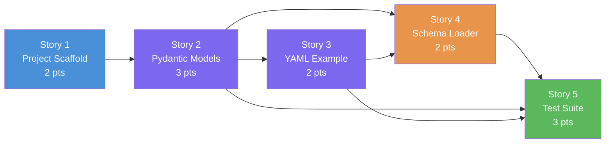

# Slice 2: YAML Graph Schema Registry — User Stories

> **Parent Slice:** Slice 2 of Phase 1 (Foundation & Infrastructure) — `plan/v1/slices.md`
> **Status:** Ready for implementation
> **Depends on:** Slice 1 ✅ (dev environment delivered)
> **Blocks:** Slice 3 (Cypher DDL Generator), Slice 4 (Schema Initializer), Slice 5 (CLI)

---

## Story 1: Python Project Scaffold & Dependency Wiring

**As a** Backend Developer,
**I want** a properly structured Python project with all required packages installed and importable,
**So that** every subsequent story can immediately write code without fighting import errors or missing dependencies.

### Technical Context

Currently `src/` contains only a `.gitkeep`. This story lays the package skeleton so all downstream stories have a real importable module tree.

**Files to create:**
```
src/__init__.py                   # empty — marks src as a package
src/models/__init__.py            # empty
src/utils/__init__.py             # empty
src/orchestrator/__init__.py      # empty
config/.gitkeep                   # preserve config/ as a tracked directory
```

**`requirements.txt` additions** (append to existing file):
```
pydantic>=2.7
pyyaml>=6.0
```

**`pyproject.toml`** — confirm (or add) `[tool.pytest.ini_options]` section:
```toml
[tool.pytest.ini_options]
testpaths = ["tests"]
```

**Validation:**
```bash
python -c "from src.models import schema; print('OK')"
python -c "import pydantic; import yaml; print(pydantic.__version__)"
```

### Acceptance Criteria
- [ ] `src/__init__.py`, `src/models/__init__.py`, `src/utils/__init__.py`, `src/orchestrator/__init__.py` all exist and are importable.
- [ ] `pip install -r requirements.txt` completes without errors (pydantic v2 and pyyaml present).
- [ ] `python -c "from src.models import schema"` exits with code 0 (even if schema.py is empty at this point — it must exist).
- [ ] No existing tests in `tests/test_dev_environment.py` regress.

### Definition of Done
- [ ] Code written and committed.
- [ ] Tests pass with >80% coverage on new code.
- [ ] Technical docs / docstrings updated.
- [ ] Reviewed and merged.

### Dependencies
- Depends on: none (Slice 1 already complete)
- Blocks: Story 2, Story 3, Story 4, Story 5

### Estimated Points
**2**

---

## Story 2: Pydantic v2 Schema Models (`src/models/schema.py`)

**As a** Backend Developer,
**I want** a complete set of strictly-typed Pydantic v2 models that mirror every construct in the YAML schema,
**So that** loading the YAML file produces a fully validated, type-safe `GraphSchema` object that all downstream components can consume without defensive coding.

### Technical Context

**File to create:** `src/models/schema.py`

**Full class hierarchy** (in dependency order):

```python
from __future__ import annotations
from typing import Literal, List, Optional
from pydantic import BaseModel, Field, model_validator


# ── Property & constraint primitives ─────────────────────────────────────────

class ConstraintConfig(BaseModel):
    """One constraint on a single property (uniqueness or not-null)."""
    type: Literal["uniqueness", "not_null"]

class IndexConfig(BaseModel):
    """One index on a single property."""
    type: Literal["range", "text"]

class PropertyConfig(BaseModel):
    """A single property on a node or edge label."""
    type: Literal["string", "integer", "float", "date", "datetime"]
    required: bool = False
    constraint: Optional[ConstraintConfig] = None
    index: Optional[IndexConfig] = None


# ── Node & Edge configs ───────────────────────────────────────────────────────

class NodeConfig(BaseModel):
    """Configuration for a single node label."""
    label: str
    topic: str
    key_property: str
    properties: dict[str, PropertyConfig] = Field(default_factory=dict)

    @model_validator(mode="after")
    def key_property_must_exist(self) -> "NodeConfig":
        if self.key_property not in self.properties:
            raise ValueError(
                f"key_property '{self.key_property}' not found in properties of node '{self.label}'"
            )
        return self

    @model_validator(mode="after")
    def at_least_one_property(self) -> "NodeConfig":
        if not self.properties:
            raise ValueError(f"Node '{self.label}' must have at least one property.")
        return self


class SourceTargetConfig(BaseModel):
    """The source and target node labels for an edge."""
    source: str
    target: str

    @property
    def is_self_referencing(self) -> bool:
        return self.source == self.target


class MixAndBatchConfig(BaseModel):
    """Deadlock-prevention batching parameters for edge loading."""
    batch_size: int = Field(default=1000, gt=0)
    forward_slot_ms: int = Field(default=500, gt=0)
    backward_slot_ms: int = Field(default=500, gt=0)


class RetryConfig(BaseModel):
    """Exponential-backoff retry settings."""
    max_attempts: int = Field(default=3, ge=1)
    base_delay_seconds: float = Field(default=1.0, gt=0)
    max_delay_seconds: float = Field(default=60.0, gt=0)


class DeadLetterConfig(BaseModel):
    """DLQ routing for messages that fail after all retries."""
    topic: str
    enabled: bool = True


class LoadingConfig(BaseModel):
    """Bulk vs streaming loading behaviour."""
    mode: Literal["bulk", "stream"] = "stream"
    consumer_group_id: str = "graph-loader"
    max_poll_interval_ms: int = Field(default=300_000, gt=0)
    session_timeout_ms: int = Field(default=45_000, gt=0)


class EdgeConfig(BaseModel):
    """Configuration for a single relationship type."""
    type: str          # e.g. "WORKS_AT"
    topic: str
    nodes: SourceTargetConfig
    properties: dict[str, PropertyConfig] = Field(default_factory=dict)
    mix_and_batch: MixAndBatchConfig = Field(default_factory=MixAndBatchConfig)
    retry: RetryConfig = Field(default_factory=RetryConfig)
    dead_letter: Optional[DeadLetterConfig] = None

    @model_validator(mode="after")
    def at_least_one_property(self) -> "EdgeConfig":
        if not self.properties:
            raise ValueError(f"Edge '{self.type}' must have at least one property.")
        return self


# ── Top-level schema ──────────────────────────────────────────────────────────

class GraphSchema(BaseModel):
    """Root model — the complete graph schema loaded from YAML."""
    nodes: List[NodeConfig]
    edges: List[EdgeConfig]
    loading: LoadingConfig = Field(default_factory=LoadingConfig)

    @model_validator(mode="after")
    def no_duplicate_labels(self) -> "GraphSchema":
        labels = [n.label for n in self.nodes]
        if len(labels) != len(set(labels)):
            raise ValueError("Duplicate node labels detected in schema.")
        types = [e.type for e in self.edges]
        if len(types) != len(set(types)):
            raise ValueError("Duplicate edge types detected in schema.")
        return self
```

**Key validation rules enforced:**
- `key_property` must be a key in `properties` — raises `ValidationError` with path `nodes[i].key_property`.
- Every node and edge must have ≥1 property.
- `PropertyConfig.type` is an enum — any other string raises `ValidationError`.
- `ConstraintConfig.type` ∈ `{uniqueness, not_null}`.
- Duplicate node labels / edge types raise `ValidationError`.
- `SourceTargetConfig.is_self_referencing` property flags `Person-KNOWS-Person` patterns (used by Slice 3 to isolate such edges).

### Acceptance Criteria
- [ ] `from src.models.schema import GraphSchema, NodeConfig, EdgeConfig` imports cleanly.
- [ ] A dict with a valid schema structure can be parsed: `GraphSchema.model_validate(data)` returns a `GraphSchema` with typed fields.
- [ ] Passing `key_property="nonexistent"` raises `pydantic.ValidationError` containing `"key_property"` in the error message.
- [ ] Passing `properties={}` raises `pydantic.ValidationError` for both nodes and edges.
- [ ] Passing `type="blob"` for a `PropertyConfig` raises `ValidationError`.
- [ ] `SourceTargetConfig(source="Person", target="Person").is_self_referencing` is `True`.
- [ ] No existing tests regress.

### Definition of Done
- [ ] Code written and committed.
- [ ] Tests pass with >80% coverage on new code.
- [ ] Technical docs / docstrings updated.
- [ ] Reviewed and merged.

### Dependencies
- Depends on: Story 1
- Blocks: Story 3, Story 4, Story 5

### Estimated Points
**3**

---

## Story 3: Canonical `config/graph_schema.yaml` Example

**As a** Data Engineer,
**I want** a fully worked, commented YAML schema file in `config/graph_schema.yaml`,
**So that** I have a living reference that exercises every feature of the schema (node types, edge types, self-referencing edge, all property types, both constraint types, both index types) and can use it as a starter template.

### Technical Context

**File to create:** `config/graph_schema.yaml`

The file must cover the minimum required by the Slice 2 DoD:
- ≥ 2 node types (`Person`, `Company`)
- ≥ 2 edge types (`WORKS_AT`, `KNOWS` — where `KNOWS` is self-referencing `Person→Person`)
- All five property types: `string`, `integer`, `float`, `date`, `datetime`
- Both constraint types: `uniqueness`, `not_null`
- Both index types: `range`, `text`

**Full YAML content:**

```yaml
# config/graph_schema.yaml
# ─────────────────────────────────────────────────────────────────────────────
# Neo4j Graph Loader — Canonical Graph Schema
#
# This file defines the complete graph model. Edit it to add new node labels,
# relationship types, properties, constraints, and indexes. All changes here
# are picked up automatically on the next pipeline start — no code changes
# required.
# ─────────────────────────────────────────────────────────────────────────────

loading:
  mode: stream                      # bulk | stream
  consumer_group_id: graph-loader
  max_poll_interval_ms: 300000
  session_timeout_ms: 45000

nodes:

  - label: Person
    topic: person-events             # Kafka topic that carries Person records
    key_property: personId           # Must match a property name below
    properties:
      personId:
        type: string
        required: true
        constraint:
          type: uniqueness           # → CREATE CONSTRAINT person_personid_unique
      name:
        type: string
        required: true
        constraint:
          type: not_null             # → CREATE CONSTRAINT person_name_not_null
        index:
          type: text                 # → CREATE TEXT INDEX person_name_text
      age:
        type: integer
        required: false
        index:
          type: range                # → CREATE RANGE INDEX person_age_range
      salary:
        type: float
        required: false
      birthDate:
        type: date
        required: false
      lastLogin:
        type: datetime
        required: false

  - label: Company
    topic: company-events
    key_property: companyId
    properties:
      companyId:
        type: string
        required: true
        constraint:
          type: uniqueness           # → CREATE CONSTRAINT company_companyid_unique
      name:
        type: string
        required: true
        constraint:
          type: not_null
        index:
          type: text                 # → CREATE TEXT INDEX company_name_text
      foundedYear:
        type: integer
        required: false
        index:
          type: range

edges:

  - type: WORKS_AT
    topic: works-at-events
    nodes:
      source: Person
      target: Company
    properties:
      since:
        type: date
        required: true
        constraint:
          type: not_null
      role:
        type: string
        required: false
    mix_and_batch:
      batch_size: 1000
      forward_slot_ms: 500
      backward_slot_ms: 500
    retry:
      max_attempts: 3
      base_delay_seconds: 1.0
      max_delay_seconds: 60.0
    dead_letter:
      topic: dlq-works-at
      enabled: true

  - type: KNOWS
    topic: knows-events
    nodes:
      source: Person
      target: Person               # Self-referencing — will be isolated by loader
    properties:
      since:
        type: date
        required: true
        constraint:
          type: not_null
      strength:
        type: float
        required: false
    mix_and_batch:
      batch_size: 500
      forward_slot_ms: 500
      backward_slot_ms: 500
    retry:
      max_attempts: 5
      base_delay_seconds: 2.0
      max_delay_seconds: 120.0
    dead_letter:
      topic: dlq-knows
      enabled: true
```

**Validation step** (part of this story's DoD):
```bash
python -c "
from src.utils.schema_loader import load_schema
schema = load_schema('config/graph_schema.yaml')
print(f'Loaded {len(schema.nodes)} nodes, {len(schema.edges)} edges')
"
```
*(Note: `schema_loader.py` is created in Story 4 — this test is run after Story 4 merges.)*

### Acceptance Criteria
- [ ] `config/graph_schema.yaml` exists and is parseable by PyYAML without errors.
- [ ] The file contains ≥2 node types, ≥2 edge types (including one self-referencing).
- [ ] All five `PropertyConfig.type` values are used at least once.
- [ ] Both `constraint.type` values (`uniqueness`, `not_null`) appear.
- [ ] Both `index.type` values (`range`, `text`) appear.
- [ ] Every field has an inline comment explaining its purpose.
- [ ] `GraphSchema.model_validate(yaml.safe_load(open("config/graph_schema.yaml")))` succeeds without raising `ValidationError`.

### Definition of Done
- [ ] Code written and committed.
- [ ] Tests pass with >80% coverage on new code.
- [ ] Technical docs / docstrings updated.
- [ ] Reviewed and merged.

### Dependencies
- Depends on: Story 2 (needs `GraphSchema` to validate)
- Blocks: Story 4 (schema_loader), Story 5 (test suite)

### Estimated Points
**2**

---

## Story 4: Schema Loader Utility (`src/utils/schema_loader.py`)

**As a** Backend Developer,
**I want** a single `load_schema(path)` function that reads the YAML file and returns a validated `GraphSchema`,
**So that** every component in the pipeline (schema initializer, CLI, Cypher generator) has one canonical way to load the schema — no YAML parsing scattered across the codebase.

### Technical Context

**File to create:** `src/utils/schema_loader.py`

```python
"""
src/utils/schema_loader.py
──────────────────────────
Utility for loading and validating the graph schema YAML file.

All pipeline components should obtain the schema exclusively through
``load_schema()``. This ensures a single parse + validation point and
gives callers a fully typed ``GraphSchema`` object.
"""
from __future__ import annotations

import os
from pathlib import Path

import yaml
from pydantic import ValidationError

from src.models.schema import GraphSchema


class SchemaLoadError(Exception):
    """Raised when the schema YAML cannot be read or fails Pydantic validation."""


def load_schema(path: str | os.PathLike) -> GraphSchema:
    """Load, parse, and validate the graph schema YAML file.

    Parameters
    ----------
    path:
        Absolute or relative file-system path to the YAML schema file
        (e.g. ``"config/graph_schema.yaml"``).

    Returns
    -------
    GraphSchema
        A fully validated, typed schema object.

    Raises
    ------
    SchemaLoadError
        If the file does not exist, cannot be parsed as YAML, or fails
        Pydantic validation.  The original exception is chained via
        ``raise ... from`` so callers can inspect the root cause.
    """
    resolved = Path(path).resolve()

    # ── 1. File existence check ───────────────────────────────────────────────
    if not resolved.is_file():
        raise SchemaLoadError(f"Schema file not found: {resolved}")

    # ── 2. YAML parse ─────────────────────────────────────────────────────────
    try:
        with resolved.open("r", encoding="utf-8") as fh:
            raw: dict = yaml.safe_load(fh)
    except yaml.YAMLError as exc:
        raise SchemaLoadError(f"Failed to parse YAML at {resolved}: {exc}") from exc

    if not isinstance(raw, dict):
        raise SchemaLoadError(
            f"Schema file must be a YAML mapping at the root level, got: {type(raw).__name__}"
        )

    # ── 3. Pydantic validation ────────────────────────────────────────────────
    try:
        return GraphSchema.model_validate(raw)
    except ValidationError as exc:
        raise SchemaLoadError(
            f"Schema validation failed for {resolved}:\n{exc}"
        ) from exc
```

**Error messages must be actionable** — e.g.:
- File not found → `SchemaLoadError: Schema file not found: /abs/path/to/file.yaml`
- Bad YAML → `SchemaLoadError: Failed to parse YAML at ...: <yaml error>`
- Pydantic failure → `SchemaLoadError: Schema validation failed for ...\n<pydantic error with field paths>`

### Acceptance Criteria
- [ ] `load_schema("config/graph_schema.yaml")` returns a `GraphSchema` instance with `.nodes` and `.edges` populated.
- [ ] `load_schema("nonexistent.yaml")` raises `SchemaLoadError` with "not found" in the message.
- [ ] Passing a path to a file with invalid YAML syntax raises `SchemaLoadError` chaining a `yaml.YAMLError`.
- [ ] Passing a path to a YAML file that fails Pydantic validation (e.g., missing `key_property`) raises `SchemaLoadError` chaining a `pydantic.ValidationError`.
- [ ] The returned `GraphSchema` from the canonical file has `len(schema.nodes) == 2` and `len(schema.edges) == 2`.
- [ ] No existing tests regress.

### Definition of Done
- [ ] Code written and committed.
- [ ] Tests pass with >80% coverage on new code.
- [ ] Technical docs / docstrings updated.
- [ ] Reviewed and merged.

### Dependencies
- Depends on: Story 2 (GraphSchema), Story 3 (YAML file to load)
- Blocks: Story 5

### Estimated Points
**2**

---

## Story 5: Unit Test Suite (`tests/test_schema_validation.py`)

**As a** Backend Developer,
**I want** a comprehensive pytest test suite for the schema models and loader,
**So that** regressions in the YAML contract are caught immediately in CI and future contributors know the exact validation guarantees.

### Technical Context

**File to create:** `tests/test_schema_validation.py`

**Test structure** — use pytest parametrize to keep the file concise:

```python
"""
tests/test_schema_validation.py
────────────────────────────────
Unit tests for:
  - src/models/schema.py  (Pydantic models)
  - src/utils/schema_loader.py  (YAML → GraphSchema pipeline)
"""
import pytest
from pydantic import ValidationError

from src.models.schema import (
    ConstraintConfig,
    DeadLetterConfig,
    EdgeConfig,
    GraphSchema,
    IndexConfig,
    LoadingConfig,
    MixAndBatchConfig,
    NodeConfig,
    PropertyConfig,
    RetryConfig,
    SourceTargetConfig,
)
from src.utils.schema_loader import SchemaLoadError, load_schema


# ── Helpers ───────────────────────────────────────────────────────────────────

def _minimal_node(label="Person", key="pid") -> dict:
    return {
        "label": label,
        "topic": f"{label.lower()}-events",
        "key_property": key,
        "properties": {key: {"type": "string", "required": True}},
    }

def _minimal_edge(etype="KNOWS") -> dict:
    return {
        "type": etype,
        "topic": f"{etype.lower()}-events",
        "nodes": {"source": "Person", "target": "Person"},
        "properties": {"since": {"type": "date", "required": True}},
    }

def _valid_schema_dict() -> dict:
    return {
        "nodes": [_minimal_node("Person", "personId"), _minimal_node("Company", "companyId")],
        "edges": [_minimal_edge("WORKS_AT"), _minimal_edge("KNOWS")],
    }


# ── PropertyConfig ────────────────────────────────────────────────────────────

class TestPropertyConfig:
    def test_valid_string_property(self):
        p = PropertyConfig(type="string")
        assert p.type == "string"
        assert p.required is False

    @pytest.mark.parametrize("ptype", ["string", "integer", "float", "date", "datetime"])
    def test_all_valid_types_accepted(self, ptype):
        PropertyConfig(type=ptype)  # must not raise

    def test_invalid_type_raises(self):
        with pytest.raises(ValidationError, match="type"):
            PropertyConfig(type="blob")

    def test_constraint_embedded(self):
        p = PropertyConfig(type="string", constraint={"type": "uniqueness"})
        assert p.constraint.type == "uniqueness"

    def test_index_embedded(self):
        p = PropertyConfig(type="integer", index={"type": "range"})
        assert p.index.type == "range"


# ── ConstraintConfig ──────────────────────────────────────────────────────────

class TestConstraintConfig:
    @pytest.mark.parametrize("ctype", ["uniqueness", "not_null"])
    def test_valid_constraint_types(self, ctype):
        ConstraintConfig(type=ctype)

    def test_invalid_constraint_type_raises(self):
        with pytest.raises(ValidationError):
            ConstraintConfig(type="foreign_key")


# ── NodeConfig ────────────────────────────────────────────────────────────────

class TestNodeConfig:
    def test_valid_node(self):
        node = NodeConfig(**_minimal_node())
        assert node.label == "Person"

    def test_missing_key_property_raises(self):
        bad = _minimal_node()
        bad["key_property"] = "nonexistent"
        with pytest.raises(ValidationError, match="key_property"):
            NodeConfig(**bad)

    def test_empty_properties_raises(self):
        bad = _minimal_node()
        bad["properties"] = {}
        with pytest.raises(ValidationError, match="at least one property"):
            NodeConfig(**bad)

    def test_missing_topic_raises(self):
        bad = _minimal_node()
        del bad["topic"]
        with pytest.raises(ValidationError):
            NodeConfig(**bad)


# ── SourceTargetConfig ────────────────────────────────────────────────────────

class TestSourceTargetConfig:
    def test_self_referencing_detected(self):
        st = SourceTargetConfig(source="Person", target="Person")
        assert st.is_self_referencing is True

    def test_non_self_referencing(self):
        st = SourceTargetConfig(source="Person", target="Company")
        assert st.is_self_referencing is False


# ── EdgeConfig ────────────────────────────────────────────────────────────────

class TestEdgeConfig:
    def test_valid_edge(self):
        edge = EdgeConfig(**_minimal_edge())
        assert edge.type == "KNOWS"

    def test_empty_properties_raises(self):
        bad = _minimal_edge()
        bad["properties"] = {}
        with pytest.raises(ValidationError, match="at least one property"):
            EdgeConfig(**bad)

    def test_mix_and_batch_defaults(self):
        edge = EdgeConfig(**_minimal_edge())
        assert edge.mix_and_batch.batch_size == 1000

    def test_self_referencing_edge_detectable(self):
        edge = EdgeConfig(**_minimal_edge("KNOWS"))
        assert edge.nodes.is_self_referencing is True


# ── GraphSchema ───────────────────────────────────────────────────────────────

class TestGraphSchema:
    def test_valid_schema_parses(self):
        schema = GraphSchema.model_validate(_valid_schema_dict())
        assert len(schema.nodes) == 2
        assert len(schema.edges) == 2

    def test_duplicate_node_labels_raises(self):
        data = _valid_schema_dict()
        data["nodes"].append(_minimal_node("Person", "pid2"))  # duplicate label
        with pytest.raises(ValidationError, match="Duplicate node labels"):
            GraphSchema.model_validate(data)

    def test_duplicate_edge_types_raises(self):
        data = _valid_schema_dict()
        data["edges"].append(_minimal_edge("KNOWS"))  # duplicate type
        with pytest.raises(ValidationError, match="Duplicate edge types"):
            GraphSchema.model_validate(data)

    def test_loading_config_defaults(self):
        schema = GraphSchema.model_validate(_valid_schema_dict())
        assert schema.loading.mode == "stream"
        assert schema.loading.consumer_group_id == "graph-loader"


# ── SchemaLoader ──────────────────────────────────────────────────────────────

class TestSchemaLoader:
    def test_loads_canonical_yaml(self):
        schema = load_schema("config/graph_schema.yaml")
        assert len(schema.nodes) == 2
        assert len(schema.edges) == 2

    def test_missing_file_raises_schema_load_error(self, tmp_path):
        with pytest.raises(SchemaLoadError, match="not found"):
            load_schema(tmp_path / "nonexistent.yaml")

    def test_invalid_yaml_raises_schema_load_error(self, tmp_path):
        bad_yaml = tmp_path / "bad.yaml"
        bad_yaml.write_text("nodes: [unclosed bracket", encoding="utf-8")
        with pytest.raises(SchemaLoadError, match="parse"):
            load_schema(bad_yaml)

    def test_pydantic_failure_raises_schema_load_error(self, tmp_path):
        import yaml
        bad_schema = tmp_path / "bad_schema.yaml"
        bad_schema.write_text(
            yaml.dump({
                "nodes": [{"label": "X", "topic": "t", "key_property": "MISSING",
                           "properties": {"id": {"type": "string"}}}],
                "edges": [],
            }),
            encoding="utf-8",
        )
        with pytest.raises(SchemaLoadError, match="validation failed"):
            load_schema(bad_schema)

    def test_non_mapping_yaml_raises(self, tmp_path):
        bad = tmp_path / "list.yaml"
        bad.write_text("- item1\n- item2\n", encoding="utf-8")
        with pytest.raises(SchemaLoadError, match="mapping"):
            load_schema(bad)
```

**Coverage target:** `pytest --cov=src/models --cov=src/utils --cov-report=term-missing` must show ≥80% on both modules.

### Acceptance Criteria
- [ ] All tests in `tests/test_schema_validation.py` pass under `pytest`.
- [ ] `TestPropertyConfig`, `TestConstraintConfig`, `TestNodeConfig`, `TestSourceTargetConfig`, `TestEdgeConfig`, `TestGraphSchema`, `TestSchemaLoader` classes all present.
- [ ] Self-referencing edge test passes.
- [ ] Missing `key_property` test produces a `ValidationError` mentioning `"key_property"`.
- [ ] Empty `properties` test produces a `ValidationError` mentioning `"at least one property"`.
- [ ] Loader tests cover: happy path, file not found, bad YAML syntax, Pydantic failure, non-mapping root.
- [ ] Coverage ≥80% on `src/models/schema.py` and `src/utils/schema_loader.py`.
- [ ] No existing tests in `tests/test_dev_environment.py` regress.

### Definition of Done
- [ ] Code written and committed.
- [ ] Tests pass with >80% coverage on new code.
- [ ] Technical docs / docstrings updated.
- [ ] Reviewed and merged.

### Dependencies
- Depends on: Story 2 (models), Story 3 (YAML file), Story 4 (schema_loader)
- Blocks: none (terminal story for this slice)

### Estimated Points
**3**

---

## Story Map



**Execution Order:** S1 → S2 → S3 → S4 → S5

---

## Total Estimate

| Story | Name | Points |
|---|---|---|
| 1 | Project Scaffold & Dependency Wiring | 2 |
| 2 | Pydantic v2 Schema Models | 3 |
| 3 | Canonical `graph_schema.yaml` | 2 |
| 4 | Schema Loader Utility | 2 |
| 5 | Unit Test Suite | 3 |
| **Total** | | **12 points** |

**Sprint estimate:** ~0.4 sprints (assuming 30 points/sprint) — well within a single sprint.

---

## Open Questions for Product Owner

> [!NOTE]
> The following items need clarification before implementation begins. They will not block Story 1 or Story 2 but must be resolved before Story 3 (the canonical YAML) is finalised.

1. **Relationship indexes** — The `slices.md` DoD requires only node indexes. Should `EdgeConfig` also support `index` on its properties for Phase 1, or is that deferred to Phase 3 (when the Cypher generator handles relationship indexes)?
   - *Recommendation:* Include `IndexConfig` on `PropertyConfig` for edges now (the model supports it), but the Cypher generator (Slice 3) will skip relationship indexes in Phase 1. Flag with a `# TODO: Phase 3` comment in the YAML.

2. **`loading.consumer_group_id` scope** — Should each node/edge type override the consumer group ID individually, or is one global group ID sufficient for Phase 1?
   - *Current design:* One global group ID in `LoadingConfig`. Per-loader override is a Phase 2 concern.

3. **Multi-file schema composition** — The DoD explicitly calls this OUT of scope, but should the loader silently warn (log a `WARNING`) if it detects `!include` directives in the YAML (which `yaml.safe_load` would ignore)?
   - *Recommendation:* No — keep it simple in Phase 1. Add a note to the README instead.
