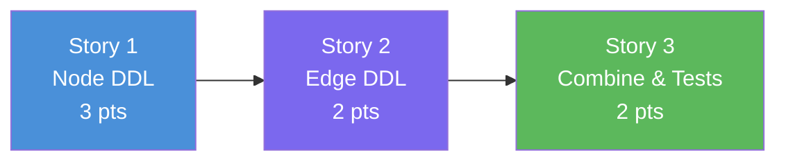

# Slice 3: Cypher DDL Generator — User Stories

> **Parent Slice:** Slice 3 of Phase 1 (Foundation & Infrastructure) — `plan/v1/slices.md`
> **Status:** Ready for implementation
> **Depends on:** Slice 2 ✅ (YAML Schema Registry)
> **Blocks:** Slice 4 (Schema Initializer)

---

## Story 1: Node DDL Generator Core

**As a** Neo4j Administrator,
**I want** the system to generate idempotent Cypher `CREATE CONSTRAINT` and `CREATE INDEX` statements for Node properties based on the YAML schema,
**So that** node constraints and indexes correctly reflect the data model.

### Technical Context
**File to create:** `src/utils/cypher_generator.py`

Implement a pure Python function that takes a `GraphSchema` and returns a `list[str]` of Cypher statements for all `NodeConfig` elements.

**Functions:**
```python
def generate_node_ddl(schema: GraphSchema) -> list[str]:
    """Generates DDL for all nodes in the schema."""
    pass
```

**Generation Logic:**
- Iterate over `schema.nodes`. For each node, iterate over `properties`.
- Check `prop.constraint` and `prop.index`.
- Constraint naming convention: `<label>_<property>_<type>` (lowercase).
  - Uniqueness: `CREATE CONSTRAINT <name> IF NOT EXISTS FOR (n:<Label>) REQUIRE n.<prop> IS UNIQUE`
  - Not Null: `CREATE CONSTRAINT <name> IF NOT EXISTS FOR (n:<Label>) REQUIRE n.<prop> IS NOT NULL`
- Index naming convention: `<label>_<property>_<type>` (lowercase).
  - Range: `CREATE RANGE INDEX <name> IF NOT EXISTS FOR (n:<Label>) ON (n.<prop>)`
  - Text: `CREATE TEXT INDEX <name> IF NOT EXISTS FOR (n:<Label>) ON (n.<prop>)`

### Acceptance Criteria
- [ ] Returns correct Cypher for uniqueness constraint.
- [ ] Returns correct Cypher for not_null constraint.
- [ ] Returns correct Cypher for range index.
- [ ] Returns correct Cypher for text index.
- [ ] All statements include `IF NOT EXISTS` for idempotency.
- [ ] Constraint/index names are fully lowercase.

### Definition of Done
- [ ] Code written and committed.
- [ ] Tests pass with >80% coverage on new code.
- [ ] Technical docs / docstrings updated.
- [ ] Reviewed and merged.

### Dependencies
- Depends on: None (Slice 2 provides `GraphSchema`)
- Blocks: Story 2, Story 3

### Estimated Points
**3**

---

## Story 2: Edge DDL Generator

**As a** Neo4j Administrator,
**I want** the system to generate idempotent `CREATE INDEX` statements for Edge (relationship) properties,
**So that** relationship queries are performant and reflect the data model.

### Technical Context
**File to modify:** `src/utils/cypher_generator.py`

Extend the generator to handle `EdgeConfig` elements. Note that Neo4j supports relationship indexes but *not* relationship uniqueness constraints (in standard editions/versions without key constraints on relationships, but `slices.md` only specifies node constraints anyway).
Actually, the DoD for Slice 3 says: `CREATE RANGE INDEX <name> IF NOT EXISTS FOR ()-[r:TYPE]-() ON (r.prop)` (relationship indexes).

**Functions:**
```python
def generate_edge_ddl(schema: GraphSchema) -> list[str]:
    """Generates DDL for all edges in the schema."""
    pass
```

**Generation Logic:**
- Iterate over `schema.edges`. For each edge, iterate over `properties`.
- Check `prop.index`. (If `prop.constraint` is set on an edge, warn or ignore it for now, as `slices.md` does not specify edge constraints).
- Index naming convention: `<type>_<property>_<type>` (lowercase).
  - Range: `CREATE RANGE INDEX <name> IF NOT EXISTS FOR ()-[r:<TYPE>]-() ON (r.<prop>)`
  - Text: `CREATE TEXT INDEX <name> IF NOT EXISTS FOR ()-[r:<TYPE>]-() ON (r.<prop>)`

*(Note: The PO was previously asked about relationship indexes in Slice 2. The decision is to generate them here if defined in the schema).*

### Acceptance Criteria
- [ ] Returns correct Cypher for edge range index.
- [ ] Returns correct Cypher for edge text index.
- [ ] Index names are fully lowercase.

### Definition of Done
- [ ] Code written and committed.
- [ ] Tests pass with >80% coverage on new code.
- [ ] Technical docs / docstrings updated.
- [ ] Reviewed and merged.

### Dependencies
- Depends on: Story 1
- Blocks: Story 3

### Estimated Points
**2**

---

## Story 3: Combined Generator & Test Suite

**As a** Backend Developer,
**I want** a single entry point to generate all DDL for a schema and a complete test suite,
**So that** the Schema Initializer can easily consume the output, and regressions are caught.

### Technical Context
**File to modify:** `src/utils/cypher_generator.py`
**File to create:** `tests/test_cypher_generator.py`

**Functions:**
```python
def generate_all_ddl(schema: GraphSchema) -> list[str]:
    """Returns all node and edge DDL statements."""
    return generate_node_ddl(schema) + generate_edge_ddl(schema)
```

**Test Suite:**
Write `tests/test_cypher_generator.py` using `pytest`.
- Use a mock `GraphSchema` or `GraphSchema.model_validate(_valid_schema_dict())` (similar to schema tests).
- Verify exact string outputs for all 5 target formats defined in the Phase 1 `technical.md` / `slices.md` DoD.
- Test that multiple nodes/edges produce multiple statements and no duplicates are generated if not expected (though standard generation shouldn't duplicate).

### Acceptance Criteria
- [ ] `generate_all_ddl()` returns the combined list of node and edge DDL.
- [ ] `tests/test_cypher_generator.py` covers all node constraint/index variations.
- [ ] `tests/test_cypher_generator.py` covers edge index variations.
- [ ] Coverage for `src/utils/cypher_generator.py` is >80%.

### Definition of Done
- [ ] Code written and committed.
- [ ] Tests pass with >80% coverage on new code.
- [ ] Technical docs / docstrings updated.
- [ ] Reviewed and merged.

### Dependencies
- Depends on: Story 2
- Blocks: Slice 4

### Estimated Points
**2**

---

## Story Map



**Execution Order:** S1 → S2 → S3

---

## Total Estimate

| Story | Name | Points |
|---|---|---|
| 1 | Node DDL Generator Core | 3 |
| 2 | Edge DDL Generator | 2 |
| 3 | Combined Generator & Test Suite | 2 |
| **Total** | | **7 points** |

**Sprint estimate:** ~0.2 sprints (assuming 30 points/sprint).

---

## Open Questions for Product Owner

1. **Edge Constraints**: `slices.md` DoD for Slice 3 does not specify `CREATE CONSTRAINT` for relationships (edges), only `RANGE/TEXT INDEX`. However, the Pydantic `PropertyConfig` supports `constraint` on edge properties. Should the generator raise a warning, silently ignore it, or generate Enterprise relationship key constraints if an edge property has a constraint?
   *Recommendation: Silently ignore or log a warning for Phase 1. Relationship constraints are advanced Neo4j Enterprise features.*
