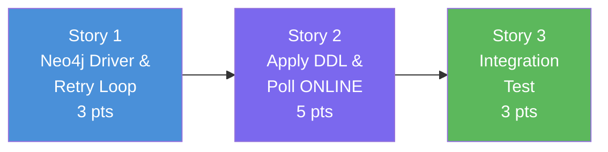

# Slice 4: Automated Schema Initializer — User Stories

> **Parent Slice:** Slice 4 of Phase 1 (Foundation & Infrastructure) — `plan/v1/slices.md`
> **Status:** Ready for implementation
> **Depends on:** Slice 3 ✅ (Cypher DDL Generator)
> **Blocks:** Slice 5 (CLI & Container Entrypoint)

---

## Story 1: Neo4j Connection & Retries

**As a** System Engineer,
**I want** the schema initializer to connect to Neo4j with robust exponential backoff,
**So that** the pipeline survives temporary database outages or container boot ordering issues without crashing immediately.

### Technical Context
**File to create:** `src/orchestrator/schema_initializer.py`
**File to create:** `tests/test_schema_initializer.py`

**Implementation:**
- Create `class SchemaInitializationError(Exception): pass`.
- Create function `get_neo4j_driver(uri, user, password, max_retries=5, base_delay=2.0) -> neo4j.Driver`.
- Use the official `neo4j` Python driver.
- Implement a retry loop capturing `neo4j.exceptions.ServiceUnavailable` and `neo4j.exceptions.AuthError`. (Auth error should not retry; connection errors should).
- Use `time.sleep()` for exponential backoff (e.g., base_delay * 2^attempt).
- If retries exhausted, raise `SchemaInitializationError`.

### Acceptance Criteria
- [ ] Connects successfully if Neo4j is available.
- [ ] Retries up to `max_retries` times on connection failure with backoff.
- [ ] Raises `SchemaInitializationError` with clear message when retries exhaust.
- [ ] Raises immediately without retry on `AuthError`.
- [ ] Unit tests mock the driver to verify retry loop behavior.

### Definition of Done
- [ ] Code written and committed.
- [ ] Tests pass with >80% coverage on new code.
- [ ] Technical docs / docstrings updated.
- [ ] Reviewed and merged.

### Dependencies
- Depends on: None
- Blocks: Story 2

### Estimated Points
**3**

---

## Story 2: DDL Execution & ONLINE Polling

**As a** Data Engineer,
**I want** the initializer to execute the DDL and block until all indexes are `ONLINE`,
**So that** no data loading begins while the database is still in a `POPULATING` state (which hurts performance and integrity).

### Technical Context
**File to modify:** `src/orchestrator/schema_initializer.py`
**File to modify:** `tests/test_schema_initializer.py`

**Implementation:**
- Create function `apply_schema(driver: neo4j.Driver, schema: GraphSchema, timeout_seconds=120)`.
- Use `from src.utils.cypher_generator import generate_all_ddl`.
- Open a Neo4j session. For each string in `generate_all_ddl(schema)`, run `session.run(stmt)`.
- **Polling Loop:**
  - Query: `SHOW INDEXES YIELD name, state WHERE state = 'POPULATING' RETURN name`
  - While the result is not empty, `time.sleep(5)`.
  - Log which indexes are still populating.
  - If `timeout_seconds` is reached, raise `SchemaInitializationError("Timeout waiting for indexes to become ONLINE")`.
  - Also ensure that if the state is `FAILED`, it raises immediately instead of waiting for timeout (query: `SHOW INDEXES YIELD name, state WHERE state = 'FAILED' RETURN name`).

### Acceptance Criteria
- [ ] Executes all generated Cypher DDL strings sequentially.
- [ ] Polls `SHOW INDEXES` and blocks while any index is `POPULATING`.
- [ ] Raises exception if any index state is `FAILED`.
- [ ] Raises `SchemaInitializationError` if timeout is exceeded.
- [ ] Returns normally when all are `ONLINE`.
- [ ] Unit tests using mocks verify execution and the polling loop.

### Definition of Done
- [ ] Code written and committed.
- [ ] Tests pass with >80% coverage on new code.
- [ ] Technical docs / docstrings updated.
- [ ] Reviewed and merged.

### Dependencies
- Depends on: Story 1
- Blocks: Story 3

### Estimated Points
**5**

---

## Story 3: Integration Test with Real Neo4j Container

**As a** Backend Developer,
**I want** to test the `apply_schema` logic against a real Neo4j container,
**So that** I am 100% confident the Neo4j queries (`SHOW INDEXES`) and constraints behave as expected in production.

### Technical Context
**File to modify:** `tests/test_schema_initializer.py` (or create a new `tests/integration/test_schema_initializer_int.py`)

**Implementation:**
- Add an integration test using `testcontainers-neo4j` (already listed in project stack context, though maybe not in `requirements.txt`).
- Wait, the DoD says "Integration test passes against a real Neo4j container". Since `docker-compose.yml` already has Neo4j and `tests/test_dev_environment.py` verifies it, we don't strictly *need* `testcontainers` if we assume the dev environment is running.
- Let's use the running dev Neo4j instance to test `apply_schema`. We will parse `config/graph_schema.yaml`, pass it to `apply_schema(driver, schema)`, and then run raw driver queries to assert `SHOW CONSTRAINTS` returns the expected names.
- Make sure to clear constraints/indexes at the start or end of the test to ensure it's repeatable.

### Acceptance Criteria
- [ ] Integration test connects to `neo4j://localhost:7687` (using env vars or defaults from `.env`).
- [ ] Applies the canonical `config/graph_schema.yaml`.
- [ ] Asserts that Neo4j `SHOW CONSTRAINTS YIELD name` contains `person_personid_unique`.
- [ ] Test is resilient/repeatable (cleans up or relies on `IF NOT EXISTS` idempotency).

### Definition of Done
- [ ] Code written and committed.
- [ ] Integration test passes against live local Neo4j.
- [ ] Technical docs / docstrings updated.
- [ ] Reviewed and merged.

### Dependencies
- Depends on: Story 2
- Blocks: Slice 5

### Estimated Points
**3**

---

## Story Map

**Execution Order:** S1 → S2 → S3

---

## Total Estimate

| Story | Name | Points |
|---|---|---|
| 1 | Neo4j Connection & Retries | 3 |
| 2 | DDL Execution & ONLINE Polling | 5 |
| 3 | Integration Test with Real Neo4j Container | 3 |
| **Total** | | **11 points** |

**Sprint estimate:** ~0.4 sprints.
