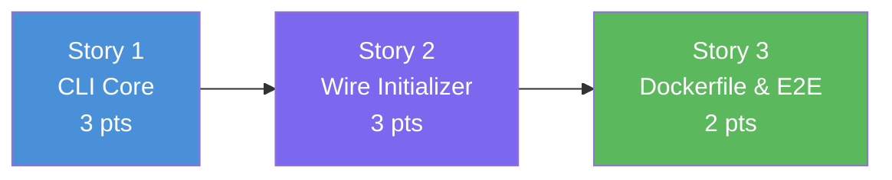

# Slice 5: Base CLI & Project Scaffold — User Stories

> **Parent Slice:** Slice 5 of Phase 1 (Foundation & Infrastructure) — `plan/v1/slices.md`
> **Status:** Ready for implementation
> **Depends on:** Slice 4 ✅ (Schema Initializer)
> **Blocks:** Phase 2 (Node Ingestion)

---

## Story 1: CLI Core & Subcommand Stubs

**As a** DevOps Engineer,
**I want** a single command-line interface with `start`, `stop`, and `status` subcommands,
**So that** I have a standardized way to operate the loader pipeline.

### Technical Context
**File to create:** `src/cli.py`
**File to create:** `tests/test_cli.py`

**Implementation:**
- Use the standard `argparse` module.
- Root command should have a `--version` or basic help string.
- Subcommands:
  - `start`: Requires `--config` (default: `config/graph_schema.yaml`), requires `--mode` (choices: `bulk`, `stream`).
  - `stop`: Optional `--loader` argument.
  - `status`: Requires `--config` (default: `config/graph_schema.yaml`).
- For now, all commands should just print a stub message (e.g., `logger.info("Starting pipeline in %s mode with config %s", args.mode, args.config)`).
- Ensure standard python entrypoint (`if __name__ == "__main__": main()`).

### Acceptance Criteria
- [ ] `python -m src.cli --help` prints the root help menu.
- [ ] `python -m src.cli start --help` prints start-specific arguments.
- [ ] Missing required arguments (e.g., `--mode` for start) produces a clear error.
- [ ] `tests/test_cli.py` verifies argument parsing using standard capturing (or direct calls to the parser).

### Definition of Done
- [ ] Code written and committed.
- [ ] Tests pass with >80% coverage on new code.
- [ ] Technical docs / docstrings updated.
- [ ] Reviewed and merged.

### Dependencies
- Depends on: None (standalone interface)
- Blocks: Story 2

### Estimated Points
**3**

---

## Story 2: Wiring 'Start' to Schema Initializer

**As a** Data Engineer,
**I want** the `start` command to automatically apply the schema constraints and indexes,
**So that** the database is prepared before ingestion begins.

### Technical Context
**File to modify:** `src/cli.py`
**File to modify:** `tests/test_cli.py`

**Implementation:**
- In the `start` command handler:
  1. Load the schema: `schema = load_schema(args.config)`
  2. Connect to Neo4j using `.env` credentials (e.g., `os.environ.get("NEO4J_URI", "bolt://localhost:7687")`).
  3. Call `apply_schema(driver, schema)`.
  4. Print/log success and cleanly close the driver.
- Gracefully handle `SchemaInitializationError` (print a clean error and exit with code 1 instead of a messy stack trace).

### Acceptance Criteria
- [ ] Calling `start` connects to Neo4j and waits for indexes.
- [ ] Proper error handling if Neo4j is offline or schema file is missing (exit code 1).
- [ ] Unit tests mock out `apply_schema` and `get_neo4j_driver` to verify the execution flow and error exits.

### Definition of Done
- [ ] Code written and committed.
- [ ] Tests pass with >80% coverage on new code.
- [ ] Technical docs / docstrings updated.
- [ ] Reviewed and merged.

### Dependencies
- Depends on: Story 1, Slice 4
- Blocks: Story 3

### Estimated Points
**3**

---

## Story 3: Dockerfile & Full Stack E2E Validation

**As a** System Operator,
**I want** the loader to be packaged in a Dockerfile,
**So that** I can build and deploy the application consistently in any environment.

### Technical Context
**File to create:** `Dockerfile`

**Implementation:**
- Create a `Dockerfile` at the project root.
- Base image: `python:3.12-slim`
- Set working directory `/app`.
- Copy `requirements.txt` and run `pip install --no-cache-dir -r requirements.txt`.
- Copy `src/`, `config/`, and `.env.example`.
- Set `ENTRYPOINT ["python", "-m", "src.cli"]`.
- Validate the build: `docker build -t graph-loader .`
- Test running it locally to confirm the entrypoint routes correctly to the CLI help text: `docker run --rm graph-loader --help`.

### Acceptance Criteria
- [ ] `Dockerfile` builds successfully.
- [ ] Running the container prints the CLI help menu.
- [ ] Running the full stack locally (`docker compose up -d` + `python -m src.cli start --config config/graph_schema.yaml --mode bulk`) initializes constraints against the live database properly.

### Definition of Done
- [ ] Code written and committed.
- [ ] Local manual validation confirms image runs.
- [ ] Technical docs / docstrings updated.
- [ ] Reviewed and merged.

### Dependencies
- Depends on: Story 2
- Blocks: Phase 2

### Estimated Points
**2**

---

## Story Map

**Execution Order:** S1 → S2 → S3

---

## Total Estimate

| Story | Name | Points |
|---|---|---|
| 1 | CLI Core & Subcommand Stubs | 3 |
| 2 | Wiring 'Start' to Schema Initializer | 3 |
| 3 | Dockerfile & Full Stack E2E Validation | 2 |
| **Total** | | **8 points** |

**Sprint estimate:** ~0.3 sprints.
