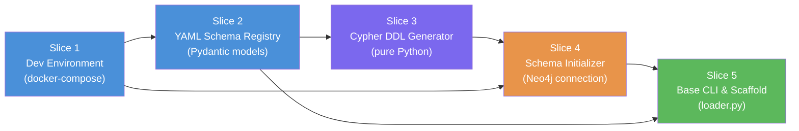

# Phase 1: Foundation & Infrastructure — Feature Slices

## Phase Summary

Phase 1 establishes the entire foundation on which all subsequent phases depend. Before a single Kafka message can be ingested into Neo4j, the team must have: a reproducible local development environment (Neo4j 5 Enterprise + Kafka running in Docker), a declarative YAML schema that defines every node type, edge type, property, constraint, and index — and the automated tooling that reads that YAML and applies it to Neo4j. Additionally, a CLI entry point must be in place so operators can drive the pipeline via simple commands. Without this phase, data engineers have no standard way to define a graph model, no guarantee of data integrity constraints, and no environment to develop against. The risk of skipping or cutting corners here compounds across every downstream phase.

---

## Slice 1: Reproducible Local Development Environment

**As a** Data Engineer,
**I want** a single command (`docker compose up`) to start a fully working Neo4j 5 Enterprise and Kafka broker stack locally,
**So that** I can develop and test the pipeline without managing manual database installs or external services.

### Scope
**IN scope:**
- `docker-compose.yaml` defining Neo4j 5 Enterprise service with correct memory settings, auth, and license acceptance env vars.
- `docker-compose.yaml` defining a Kafka broker (Confluent Community or Redpanda) in KRaft mode (no separate Zookeeper).
- A `.env.example` file documenting all required environment variables (`NEO4J_PASSWORD`, `KAFKA_BOOTSTRAP_SERVERS`, etc.).
- Health-check definitions on both services so dependent containers wait for readiness.
- A `Makefile` or `scripts/start_dev.sh` wrapping `docker compose up -d` with a readiness check.

**OUT of scope:**
- Loader containers (those are started dynamically by the CLI in later slices).
- Production-grade Docker Swarm / Kubernetes manifests.
- Cloud-managed Kafka (MSK, Confluent Cloud) configuration.
- Neo4j clustering / multi-instance setup.

### Definition of Done (DoD)
- [x] `docker compose up -d` starts Neo4j 5.x Enterprise and Kafka without errors.
- [x] Neo4j Browser is reachable at `http://localhost:7474` within 60 seconds.
- [x] Kafka is reachable at `localhost:9092`; a test topic can be created via `kafka-topics`.
- [x] Health checks pass for both services (`docker compose ps` shows all `healthy`).
- [x] `.env.example` documents every variable used in `docker-compose.yaml`.
- [x] A developer with only Docker installed can reproduce the environment in under 5 minutes following the README.

### Dependencies
- Depends on: none
- Blocks: Slice 2 (YAML Schema Registry), Slice 4 (Schema Initializer), Slice 5 (CLI)

### Rough Effort
T-shirt size: **S**

---

## Slice 2: YAML Graph Schema Registry

**As a** Data Engineer,
**I want** to define my entire graph model (node types, edge types, properties, data types, constraints, and indexes) in a single YAML file,
**So that** the pipeline configuration is version-controlled, human-readable, and drives all downstream behaviour without any code changes.

### Scope
**IN scope:**
- `config/graph_schema.yaml` — the canonical schema definition file with a fully worked example covering: at least 2 node types, 2 edge types (one self-referencing), properties with explicit types (`string`, `integer`, `float`, `date`, `datetime`), `uniqueness` and `not_null` constraints, and `range`/`text` indexes.
- `src/models/schema.py` — strictly typed Pydantic v2 models for every YAML construct: `NodeConfig`, `EdgeConfig`, `PropertyConfig`, `ConstraintConfig`, `IndexConfig`, `SourceTargetConfig`, `MixAndBatchConfig`, `RetryConfig`, `DeadLetterConfig`, `LoadingConfig`, `GraphSchema`.
- Validation rules enforced by Pydantic: required fields, allowed type values, constraint type enum, at least one property per node/edge.
- A `src/utils/schema_loader.py` utility that reads the YAML file, validates it, and returns a `GraphSchema` object.
- Unit tests in `tests/test_schema_validation.py` covering: valid schema loads, missing required field raises `ValidationError`, invalid property type raises `ValidationError`, self-referencing edge detected correctly.

**OUT of scope:**
- Hot-reload of YAML without restart.
- A UI or API to edit the schema.
- Multi-file schema composition.
- Schema migration / diffing between versions.

### Definition of Done (DoD)
- [ ] `config/graph_schema.yaml` fully covers nodes, edges, properties (with types), constraints, and indexes as per the final implementation plan YAML example.
- [ ] `GraphSchema` Pydantic model validates the file without errors.
- [ ] Invalid YAML (missing `key_property`, unsupported `type`) raises a clear `ValidationError` with field path.
- [ ] `schema_loader.py` returns a typed `GraphSchema` object from a file path.
- [ ] All unit tests in `tests/test_schema_validation.py` pass (`pytest`).
- [ ] The YAML file is documented with inline comments explaining every field.

### Dependencies
- Depends on: Slice 1 (dev environment, for running tests)
- Blocks: Slice 3 (Cypher Generator), Slice 4 (Schema Initializer), Slice 5 (CLI)

### Rough Effort
T-shirt size: **M**

---

## Slice 3: Cypher DDL Generator

**As a** Neo4j Administrator,
**I want** the system to automatically generate correct `CREATE CONSTRAINT` and `CREATE INDEX` Cypher statements from the YAML schema,
**So that** I never have to hand-write DDL and the database always reflects the declared data model exactly.

### Scope
**IN scope:**
- `src/utils/cypher_generator.py` — a pure Python module (no Neo4j connection required) that takes a `GraphSchema` object and returns a list of idempotent Cypher DDL strings.
- Supported outputs:
  - `CREATE CONSTRAINT <name> IF NOT EXISTS FOR (n:Label) REQUIRE n.prop IS UNIQUE`
  - `CREATE CONSTRAINT <name> IF NOT EXISTS FOR (n:Label) REQUIRE n.prop IS NOT NULL`
  - `CREATE RANGE INDEX <name> IF NOT EXISTS FOR (n:Label) ON (n.prop)`
  - `CREATE TEXT INDEX <name> IF NOT EXISTS FOR (n:Label) ON (n.prop)`
  - `CREATE RANGE INDEX <name> IF NOT EXISTS FOR ()-[r:TYPE]-() ON (r.prop)` (relationship indexes)
- Name generation convention: `<label>_<property>_<type>` (e.g., `person_personid_unique`), all lowercase.
- Unit tests in `tests/test_cypher_generator.py` covering: uniqueness constraint output, not-null constraint output, range index output, text index output, relationship index output, multiple nodes produce multiple statements, no duplicates.

**OUT of scope:**
- Executing the Cypher (that is Slice 4).
- `DROP CONSTRAINT` / schema migration / diffing.
- Full-text or vector indexes.

### Definition of Done (DoD)
- [ ] `cypher_generator.py` generates all constraint types correctly for any valid `GraphSchema`.
- [ ] Generated Cypher uses `IF NOT EXISTS` making it idempotent on re-run.
- [ ] Name convention is consistent and lowercase.
- [ ] All unit tests in `tests/test_cypher_generator.py` pass.
- [ ] Running generated Cypher verbatim in Neo4j Browser creates the correct constraints/indexes.

### Dependencies
- Depends on: Slice 2 (YAML Schema Registry — needs `GraphSchema` model)
- Blocks: Slice 4 (Schema Initializer)

### Rough Effort
T-shirt size: **S**

---

## Slice 4: Automated Schema Initializer

**As a** Data Engineer,
**I want** the pipeline to automatically apply all constraints and indexes to Neo4j on startup — and wait until they are fully `ONLINE` before proceeding,
**So that** concurrent loaders always operate against a fully indexed, integrity-guaranteed database without any manual DBA intervention.

### Scope
**IN scope:**
- `src/orchestrator/schema_initializer.py` — connects to Neo4j using the official Python driver (`neo4j` package), runs all DDL Cypher from the generator, then polls `SHOW CONSTRAINTS` and `SHOW INDEXES` until all are `ONLINE` (not `POPULATING`).
- Configurable timeout for the readiness wait (default 120 seconds), with clear log messages every 5 seconds showing which indexes are still populating.
- Graceful error handling: if Neo4j is unreachable, retry with exponential backoff up to a configurable limit before raising a `SchemaInitializationError`.
- Integration test in `tests/test_schema_initializer.py` that spins up the real Neo4j container (via `testcontainers-python`) and verifies constraints exist after initializer runs.

**OUT of scope:**
- Dropping or migrating existing constraints (idempotent create only).
- Altering indexes (only create-if-not-exists).
- Neo4j cluster awareness (single instance only in Phase 1).

### Definition of Done (DoD)
- [ ] `schema_initializer.py` connects to Neo4j and runs all generated DDL.
- [ ] Initializer polls and waits until all indexes are `ONLINE` before returning.
- [ ] If Neo4j is unreachable, retries with exponential backoff and raises a clear exception after timeout.
- [ ] Integration test passes against a real Neo4j container: constraints and indexes visible in `SHOW CONSTRAINTS` / `SHOW INDEXES`.
- [ ] All previously existing constraints are not duplicated (idempotency confirmed by running twice).

### Dependencies
- Depends on: Slice 1 (dev environment), Slice 2 (YAML Schema), Slice 3 (Cypher Generator)
- Blocks: Slice 5 (CLI), and all phases 2–6

### Rough Effort
T-shirt size: **M**

---

## Slice 5: Base CLI & Project Scaffold

**As a** DevOps Engineer or Data Engineer,
**I want** a single CLI entry point (`loader.py`) that accepts structured commands and arguments,
**So that** I can start, stop, and inspect the pipeline without needing to know Docker internals or run Python scripts manually.

### Scope
**IN scope:**
- Full Python project scaffold: `pyproject.toml`, `requirements.txt`, `src/`, `tests/`, `config/`, `Dockerfile`, `.env.example`, `.gitignore`.
- `src/cli.py` using `argparse` or `click` with the following subcommands (stubs in Phase 1, fully wired in later phases):
  - `start --config <path> --mode <bulk|stream>` — parses config, runs schema initializer, then starts loaders (stub for now).
  - `stop [--loader <name>]` — stops all or specific loader containers (stub).
  - `status --config <path>` — prints running containers, Kafka lag per topic, Neo4j node/relationship counts (stub).
- Phase 1 full wiring: `start` runs the Schema Initializer and prints the generated DDL + result before exiting.
- `Dockerfile` for the loader image: Python 3.12 slim, installs `requirements.txt`, sets `ENTRYPOINT ["python", "-m", "src.cli"]`.
- `tests/test_cli.py` — unit tests using `argparse`/`click` test client: verify `--mode` is required, verify `--config` defaults, verify `start` calls `schema_initializer`.

**OUT of scope:**
- Docker SDK container management (Phases 2+).
- Kafka lag monitoring implementation (Phase 6).
- Neo4j count queries (Phase 6).

### Definition of Done (DoD)
- [ ] `python -m src.cli start --config config/graph_schema.yaml --mode bulk` runs schema initializer and exits cleanly.
- [ ] `python -m src.cli --help` and all subcommand `--help` display clear usage.
- [ ] Unknown arguments produce a helpful error message.
- [ ] `Dockerfile` builds successfully: `docker build -t graph-loader .`.
- [ ] Unit tests in `tests/test_cli.py` pass.
- [ ] Running the full stack (`docker compose up -d && python -m src.cli start --config config/graph_schema.yaml --mode bulk`) creates all constraints and indexes in Neo4j.

### Dependencies
- Depends on: Slice 1, Slice 2, Slice 3, Slice 4
- Blocks: Phase 2 (Node Ingestion)

### Rough Effort
T-shirt size: **M**

---

## Slice Map

**Execution Order:** S1 → S2 → S3 → S4 → S5 (strict dependency chain)

| Slice | Name | Size | Owner |
|---|---|---|---|
| 1 | Reproducible Local Dev Environment | S | DevOps |
| 2 | YAML Graph Schema Registry | M | Data Engineer |
| 3 | Cypher DDL Generator | S | Backend Dev |
| 4 | Automated Schema Initializer | M | Backend Dev |
| 5 | Base CLI & Project Scaffold | M | Backend Dev |
