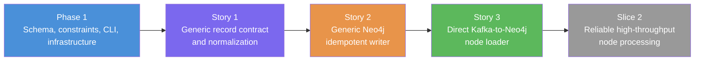

# Slice 1: Load Any Schema-Declared Node Type — User Stories

## Slice Summary

Parent: [Slice 1 — Load Any Schema-Declared Node Type](slices.md). This slice makes the existing YAML node definitions executable through one generic, directly runnable loader. It establishes a strict top-level JSON record contract, validates and normalizes values using the declared node properties, safely produces label/key-specific `MERGE` Cypher, and consumes one configured Kafka node topic into Neo4j. The work deliberately stops before Slice 2 batching, transient-write retries, durable malformed-record disposition, and Slice 3 fleet/container orchestration.

The currently available Phase 1 foundations are `src/models/schema.py`, `src/utils/schema_loader.py`, `src/orchestrator/schema_initializer.py`, `src/cli.py`, `Dockerfile`, and the Kafka/Neo4j dependencies in `requirements.txt`. `src/loader/` does not exist yet; this slice creates it. Synthetic Person and Company records from the existing `config/graph_schema.yaml` are sufficient for these stories. Production payload samples can refine the contract later but are not a blocker.

---

## Story 1: Define the Generic Node Record Contract

**As a** Data Engineer,
**I want** every configured node topic to use one validated JSON record contract,
**So that** the loader can ingest new node labels through YAML without ambiguous property mapping or unsafe Cypher identifiers.

### Technical Context

- Modify `src/models/schema.py` to validate every schema-supplied Cypher identifier interpolated by the existing DDL generator or node writer: node labels, node key/property names, edge types, and edge property names. Add a module-level `CYPHER_IDENTIFIER_RE` (or clearly named equivalent) and Pydantic validators that accept identifiers matching `^[A-Za-z_][A-Za-z0-9_]*$`; reject invalid names with a field-specific `ValidationError`. This closes the existing DDL interpolation exposure as well as the new writer's identifier path.
- Extend the existing `NodeConfig.key_property_must_exist()` validation so the referenced `PropertyConfig.required` is `True`. A node key is mandatory for every loaded record and cannot be declared optional in the schema.
- Create `src/loader/__init__.py` and `src/loader/node_loader.py`.
- In `src/loader/node_loader.py`, create these public types and functions:

  ```python
  @dataclass(frozen=True)
  class NodeRecord:
      """A validated Neo4j-ready node record for one configured NodeConfig."""
      key: object
      properties: dict[str, object]

  class NodeRecordValidationError(ValueError):
      """Raised when a Kafka JSON object violates a NodeConfig contract."""

  def normalize_node_record(
      raw_record: Mapping[str, object], node_config: NodeConfig
  ) -> NodeRecord:
      """Validate a top-level JSON node record and normalize Neo4j values."""
  ```

- The canonical raw message is a JSON object whose keys are declared node properties; for example, `{"personId": "p-001", "name": "Ada", "age": 37}`. There is no nested `properties` envelope in Slice 1.
- Enforce these rules in `normalize_node_record`:

  - A key or required property must be present and non-null.
  - An unknown key is rejected; properties are allowlisted from `NodeConfig.properties`.
  - An optional property with JSON `null` is omitted from `NodeRecord.properties`; it must not be passed as a Neo4j property value.
  - `string` accepts a Python `str`; `integer` accepts `int` but not `bool`; `float` accepts finite `int` or `float` values but not `bool`, `NaN`, or infinity; `date` accepts an ISO-8601 date string and normalizes it to `datetime.date`; `datetime` accepts an ISO-8601/RFC 3339 datetime string with an explicit offset (including `Z`) and normalizes it to an offset-aware `datetime.datetime`.
  - Validation errors name the node label and offending property, but do not include the whole raw record in the exception message.

- Create `tests/test_node_loader.py` with unit coverage for valid Person and Company records, missing key, optional key declaration, missing required property, unknown property, optional null omission, invalid scalar types, non-finite numbers, naïve/invalid date and datetime strings, and malicious/invalid node and edge schema identifiers.
- Preserve existing `src/models/schema.py` validation behavior and tests. Do not add batching, retry policy, Kafka commits, or DLQ publishing in this story.

### Acceptance Criteria

- [ ] `load_schema()` rejects every node or edge identifier that cannot safely appear in existing DDL or node-write Cypher, and rejects a node whose key property is not required.
- [ ] `normalize_node_record()` accepts valid top-level records for at least Person and Company using their distinct configured keys and property sets.
- [ ] Required/key-property, unknown-field, null, scalar-type, date, and datetime rules are enforced with actionable validation errors.
- [ ] Normalized temporal values are Python `date`/offset-aware `datetime` objects accepted by the Neo4j Python driver, and numeric values are finite.
- [ ] Unit tests in `tests/test_node_loader.py` and the existing schema-validation suite pass.

### Definition of Done

- [ ] Code written and committed.
- [ ] Tests pass with >80% coverage on new code.
- [ ] The canonical record contract is documented in module docstrings and the test fixtures.
- [ ] Reviewed and merged.

### Dependencies

- Depends on: Phase 1 — YAML Graph Schema Registry
- Blocks: Story 2 (Write Generic Idempotent Nodes)

### Estimated Points

Story points: **5**

---

## Story 2: Write Generic Idempotent Nodes to Neo4j

**As a** Data Engineer,
**I want** a generic writer that upserts a validated node using its configured label and key,
**So that** replaying a node record updates one logical graph entity instead of creating duplicates.

### Technical Context

- Extend `src/loader/node_loader.py`; do not create a second writer module. Add:

  ```python
  class NodeWriter:
      """Write normalized records for one NodeConfig through a Neo4j driver."""

      def __init__(self, driver: Driver, node_config: NodeConfig) -> None: ...

      def write(self, record: NodeRecord) -> None:
          """Execute one idempotent, parameterized node upsert."""

  def build_node_upsert_query(node_config: NodeConfig) -> str:
      """Return the safe, schema-derived UNWIND/MERGE Cypher for one label."""
  ```

- Use the Phase 2 technical plan's write pattern verbatim as the conceptual basis:

  ```python
  query = """
  UNWIND $batch AS record
  MERGE (n:Person {personId: record.personId})
  SET n += record.properties
  """
  session.execute_write(lambda tx: tx.run(query, batch=batch))
  ```

- Implement its generic equivalent using the validated schema identifiers and a singleton batch in this slice:

  ```cypher
  UNWIND $batch AS record
  MERGE (n:`<label>` {`<key_property>`: record.key})
  SET n += record.properties
  ```

  Pass only `$batch`; never interpolate message values. Interpolate only identifiers accepted by Story 1's schema validator. `record.properties` must include the key property as well as all present optional properties. This slice uses PATCH semantics: an omitted or optional-null property is not removed from an existing Neo4j node, so `SET n += record.properties` retains its previous value. Test that replay behavior explicitly.

- Execute the query through `session.execute_write(...)` and close the session in `finally`. Preserve Neo4j exceptions for the caller; transient retry is intentionally Slice 2 work.
- Add query-construction and mocked-driver tests to `tests/test_node_loader.py`. Create `tests/conftest.py` with an isolated, session-scoped Neo4j Testcontainers fixture and deterministic database cleanup; no reusable Testcontainers fixture exists today. Create `tests/test_node_loader_integration.py` for a real Neo4j integration test using that fixture: apply the Person and Company schema first, upsert each record twice with changed non-key properties, then assert exactly one node per key, the latest supplied properties, and the retention of an intentionally omitted optional property.
- Do not consume Kafka, commit offsets, buffer records, or change `src/cli.py` in this story.

### Acceptance Criteria

- [ ] The writer builds a distinct safe Cypher query for Person and Company from their `NodeConfig` values, with no hard-coded entity name.
- [ ] Query parameters contain record values only; labels and property identifiers are never accepted from Kafka payloads.
- [ ] A first write creates the configured node label and properties in Neo4j.
- [ ] A replay with the same key updates properties and leaves exactly one node for that key.
- [ ] Unit tests cover query shape and driver/session lifecycle; isolated Testcontainers integration tests cover Person and Company idempotency and PATCH semantics against Neo4j.

### Definition of Done

- [ ] Code written and committed.
- [ ] Tests pass with >80% coverage on new code.
- [ ] Public APIs have docstrings describing ownership of the Neo4j driver and session.
- [ ] Reviewed and merged.

### Dependencies

- Depends on: Story 1 (Define the Generic Node Record Contract)
- Blocks: Story 3 (Run a Direct Kafka Node Loader)

### Estimated Points

Story points: **5**

---

## Story 3: Run a Direct Kafka-to-Neo4j Node Loader

**As a** Data Engineer,
**I want** to run one selected schema-declared node loader directly from the command line,
**So that** I can ingest and replay a configured Kafka topic before container-fleet orchestration is introduced.

### Technical Context

- Extend `src/loader/node_loader.py` with the executable loader and module entrypoint:

  ```python
  class NodeLoader:
      """Consume one configured node topic and write records synchronously."""

      def __init__(self, consumer: Consumer, writer: NodeWriter,
                   node_config: NodeConfig, logger: logging.Logger) -> None: ...

      def process_message(self, message: Message) -> bool:
          """Validate and write one Kafka message; return True only after success."""

      def run(self, *, max_messages: int | None = None) -> int:
          """Poll, write, and commit successful records until interrupted or capped."""

      def close(self) -> None:
          """Close the Kafka consumer without closing the caller-owned driver."""

  def build_parser() -> argparse.ArgumentParser: ...
  def main(argv: Sequence[str] | None = None) -> int: ...
  ```

- Provide the documented invocation in `README.md`:

  ```bash
  python -m src.loader.node_loader \
    --config config/graph_schema.yaml \
    --node-label Person \
    --max-messages 10
  ```

  The command must fail clearly if `--node-label` does not identify exactly one `NodeConfig` in the loaded schema.
- Construct `confluent_kafka.Consumer` with the Phase 2 technical settings: `enable.auto.commit=False`, `auto.offset.reset="earliest"`, `max.poll.interval.ms` and `session.timeout.ms` from `schema.loading`, plus `bootstrap.servers` from `KAFKA_BOOTSTRAP_SERVERS` (default `localhost:9092`) and `group.id` from `schema.loading.consumer_group_id`. Subscribe only to the selected node's topic.
- Standardize credentials on `NEO4J_URI`, `NEO4J_USERNAME`, and `NEO4J_PASSWORD`, matching `.env.example`. Modify `src/cli.py` to prefer `NEO4J_USERNAME` and fall back to the legacy `NEO4J_USER`; add corresponding precedence coverage in `tests/test_cli.py`. Construct the direct-loader driver with the same precedence through the existing `src.orchestrator.schema_initializer.get_neo4j_driver()`.
- For each non-error Kafka message: decode UTF-8 JSON with a `parse_constant` handler that rejects non-standard numeric constants, verify it is a top-level object, normalize it with Story 1, call `NodeWriter.write()`, then synchronously commit only after the writer returns. If JSON, normalization, or a Neo4j write fails, log topic/partition/offset/node label/reason, do not commit that message, immediately stop the run with a non-zero result, and do not poll or commit any later message from that partition. Slice 2 introduces the eventual log-and-skip plus ordered durable disposition policy. Do not introduce retries, batches, DLQ publication, rebalance callbacks, or Docker SDK calls.
- `main()` owns the driver it constructs and closes both consumer and driver in `finally`, including failures during consumer construction, subscription, or `run()`.
- Add focused mocked-consumer tests in `tests/test_node_loader.py` for selected-topic subscription, success ordering (`write` before `commit`), malformed JSON, non-standard JSON constants, validation failure, Neo4j failure, immediate stop before a later message can commit past a failure, consumer error messages, `--max-messages`, credential precedence, and deterministic cleanup.
- Extend `tests/conftest.py` with isolated Kafka Testcontainers and producer/admin fixtures, including UUID-suffixed topic creation and bounded deletion. Extend `tests/test_node_loader_integration.py` to create Person and Company Kafka topics through those fixtures, produce valid records, invoke the direct loader separately for each label, and verify Neo4j creation and idempotent replay. The integration test must prove each invocation subscribes only to its selected topic.

### Acceptance Criteria

- [ ] `python -m src.loader.node_loader --config ... --node-label Person --max-messages 10` loads valid Person messages from only `person-events` into Neo4j.
- [ ] The same executable works for Company solely by changing `--node-label`, topic, and YAML configuration; no entity-specific code is added.
- [ ] Kafka auto-commit is disabled, and a successful record is committed only after its Neo4j write succeeds.
- [ ] Invalid JSON, invalid node records, Kafka errors, and Neo4j errors are logged with actionable context, do not commit the failed record, and stop the direct loader before a later commit can skip it.
- [ ] An end-to-end test covers Person and Company ingestion plus replay idempotency using isolated Kafka and Neo4j Testcontainers.
- [ ] `README.md` documents prerequisites, the standardized Neo4j environment variables (including legacy fallback), the single-loader command, and this slice's intentional limits.

### Definition of Done

- [ ] Code written and committed.
- [ ] Tests pass with >80% coverage on new code.
- [ ] The direct-loader command and error behavior are documented.
- [ ] Reviewed and merged.

### Dependencies

- Depends on: Story 2 (Write Generic Idempotent Nodes to Neo4j)
- Blocks: Slice 2 (Process Node Records Reliably at High Throughput)

### Estimated Points

Story points: **8**

---

## Story Map



## Total Estimate

**Total:** 18 story points (5 + 5 + 8).

At 30 points per sprint, this is **one sprint** with room for integration-environment variability. No story exceeds 8 points. The First Mate should start with **Story 1: Define the Generic Node Record Contract**.
