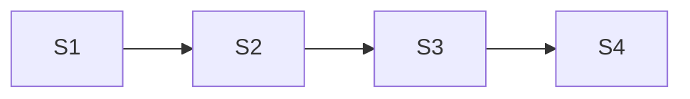

# Slice 2 — Reliable High-Throughput Node Processing

## Story 1: Schema-backed batch settings

Add validated `unwind_batch_size`, `flush_interval_ms`, and node-write retry settings to `LoadingConfig` in
`src/models/schema.py`, with documented defaults and schema tests.  Both values must be
positive and available to `NodeLoader`.

**Acceptance:** invalid values fail validation; defaults are documented and loaded from YAML.

## Story 2: Durable batched node writes

Refactor `src/loader/node_loader.py` so `NodeWriter.write_batch(records)` uses exactly one
session, transaction, and existing schema-derived `UNWIND $batch` query. Retain source Kafka
metadata beside every normalized record. A per-partition ordered resolution ledger commits only
`TopicPartition(offset=last_contiguous_resolved + 1)` after a whole batch transaction succeeds;
commit errors are fatal and leave work unresolved. Never process a later batch past an unresolved
partition barrier.

**Acceptance:** full and idle/final partial batches flush; no batch exceeds the configured
size; replay remains idempotent; a write failure leaves affected offsets uncommitted.

## Story 3: Retry and malformed-record resolution

Add bounded exponential retry only for Neo4j retryable/transient errors, retaining the complete
batch atomically; non-retryable and exhausted failures fail closed with Kafka attribution. Use
injectable monotonic clock/sleeper, cap exponential delay, retain poll heartbeats below
`max.poll.interval.ms`, and pause/cap partitions with unresolved work. Malformed JSON/schema
records are appended to an fsync'd structured JSONL rejection sink with topic, partition, offset,
node label, and reason; only successful durable append resolves their ledger entry. Document this
interim log-and-skip sink as replaced by Phase 5 DLQ routing. Rebalance/revoke handling must never
commit revoked partitions or advance past an unresolved barrier.

**Acceptance:** retries commit only after success; malformed records do not stop valid work;
per-partition commits never pass an unresolved offset; no DLQ publish occurs.

## Story 4: Integration and operational verification

Add marked Docker-backed Kafka/Neo4j coverage for multi-record batching, replay, partial flush,
retry, and malformed interleaving across partitions. Verify actual consumer-group next offsets,
commit/rejection-sink failures, retry exhaustion/non-retryable errors, poll-budget backoff, and
rebalance/barrier cases. Update README operation guidance.

**Acceptance:** representative two-label ingestion is idempotent; batching/offset ordering and
the Phase 5 DLQ migration note are verified.

## Story Map

**Estimate:** 21 points.
