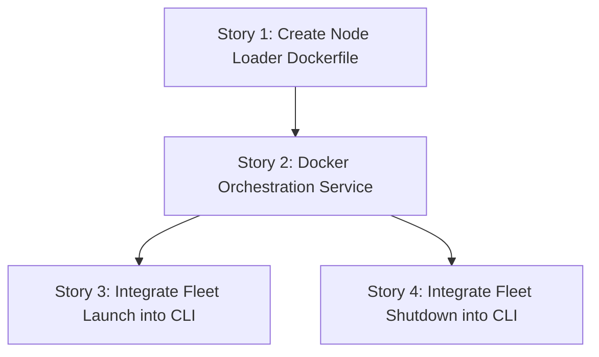

# Phase 2: Node Data Ingestion — Slice 3: Independently Scalable Node Loader Fleet

## Slice Summary
**As a** Pipeline Operator,
**I want** the CLI to launch an isolated loader for every node type in the YAML schema,
**So that** all foundational entities can load in parallel and each node workload can be operated and scaled independently.

---

## Story 1: Create Node Loader Dockerfile

**As a** Data Engineer,
**I want** a production-ready Dockerfile for the generic node loader,
**So that** the CLI can build and launch it as an isolated container for any node type.

### Technical Context
- Create `Dockerfile.node_loader` in the project root.
- Base image: `python:3.11-slim` or similar.
- Install dependencies from `requirements.txt`.
- Copy `src/` and `config/` into the image.
- Set the entrypoint to `python -m src.loader.node_loader`.
- Include an integration test in `tests/test_docker_build.py` to verify the image builds successfully using the Docker SDK `docker.from_env().images.build()`.

### Acceptance Criteria
- [ ] Dockerfile exists and installs required dependencies.
- [ ] Image builds successfully.
- [ ] Entrypoint is configured to run the node loader.

### Definition of Done
- [ ] Code written and committed.
- [ ] Tests pass with >80% coverage on new code.
- [ ] Technical docs / docstrings updated.
- [ ] Reviewed and merged.

### Dependencies
- Depends on: none
- Blocks: Story 2

### Estimated Points
Story points (Fibonacci): 2

---

## Story 2: Docker Orchestration Service

**As a** Pipeline Operator,
**I want** a dedicated Python service to manage Docker containers using the Docker SDK,
**So that** I can build images, start loaders, list running loaders, and stop them safely.

### Technical Context
- Create `src/orchestrator/docker_service.py`.
- Implement a `DockerService` class encapsulating `docker.from_env()`.
- Method `build_image(tag="graph-loader-node:latest", dockerfile="Dockerfile.node_loader")`.
- Method `run_node_loader(node_label, topic, mode, config_path, replicas=1)`.
  - Generates container names like `graph-loader-node-<label>-<replica_idx>`.
  - Sets labels on the container (e.g., `app=graph-loader`, `component=node-loader`, `node_label=<label>`).
  - Passes environment variables: `NEO4J_URI`, `NEO4J_USERNAME`, `NEO4J_PASSWORD`, `KAFKA_BOOTSTRAP_SERVERS`, and a deterministic `KAFKA_GROUP_ID` derived from a base group and the `node_label` (e.g., `loader_group_<label>`).
  - Command args passed to entrypoint: `--config <config_path> --node-label <label> --mode <mode>`.
- Method `stop_node_loaders(node_label=None)`.
  - Finds containers by Docker labels and stops/removes them.
- Method `list_node_loaders()`.
- Add unit tests mocking `docker.DockerClient`.

### Acceptance Criteria
- [ ] Service can build the image programmatically.
- [ ] Service can start a container with correct env vars, command args, and labels.
- [ ] Service can stop all or specific node loader containers.
- [ ] Uses Docker SDK, not subprocess.

### Definition of Done
- [ ] Code written and committed.
- [ ] Tests pass with >80% coverage on new code.
- [ ] Technical docs / docstrings updated.
- [ ] Reviewed and merged.

### Dependencies
- Depends on: Story 1
- Blocks: Story 3

### Estimated Points
Story points (Fibonacci): 5

---

## Story 3: Integrate Fleet Launch into CLI

**As a** Pipeline Operator,
**I want** the `start` command to discover all node types and launch their containers,
**So that** one command brings up the entire node ingestion fleet.

### Technical Context
- Modify `handle_start` in `src/cli.py`.
- After schema initialization, instantiate `DockerService`.
- Call `build_image()` to ensure the image is up-to-date.
- Iterate over `schema.nodes.values()`. For each `NodeConfig`:
  - Determine `replica_count` (default 1, though YAML model may need a `replicas` field added, or just hardcode to 1 for now if not present).
  - Launch the required number of replicas using `run_node_loader`.
- If any container fails to launch, catch the exception, log the failure, stop all successfully launched containers in this run, and exit with status 1.
- Add integration/unit tests for `handle_start` mocking `DockerService`.

### Acceptance Criteria
- [ ] `start` command iterates over all schema nodes and launches containers for each.
- [ ] Replicas are supported (even if defaulting to 1).
- [ ] Atomic start: if one node type fails to launch, the others are stopped and the command fails.

### Definition of Done
- [ ] Code written and committed.
- [ ] Tests pass with >80% coverage on new code.
- [ ] Technical docs / docstrings updated.
- [ ] Reviewed and merged.

### Dependencies
- Depends on: Story 2
- Blocks: none

### Estimated Points
Story points (Fibonacci): 3

---

## Story 4: Integrate Fleet Shutdown and Status into CLI

**As a** Pipeline Operator,
**I want** the `stop` and `status` commands to manage the running fleet,
**So that** I can cleanly shut down or inspect the loaders.

### Technical Context
- Modify `handle_stop` in `src/cli.py` to use `DockerService.stop_node_loaders(args.loader)`.
- Modify `handle_status` in `src/cli.py` to use `DockerService.list_node_loaders()` and print their statuses (running, exited) and node labels.
- Add unit tests mocking `DockerService`.

### Acceptance Criteria
- [ ] `stop` command stops all node loaders or a specific one if `--loader` is provided.
- [ ] `status` command lists running containers and their states.

### Definition of Done
- [ ] Code written and committed.
- [ ] Tests pass with >80% coverage on new code.
- [ ] Technical docs / docstrings updated.
- [ ] Reviewed and merged.

### Dependencies
- Depends on: Story 2
- Blocks: none

### Estimated Points
Story points (Fibonacci): 2

---

## Story Map

## Total Estimate
- Total points: 12
- Sprint count estimate: < 1 sprint
