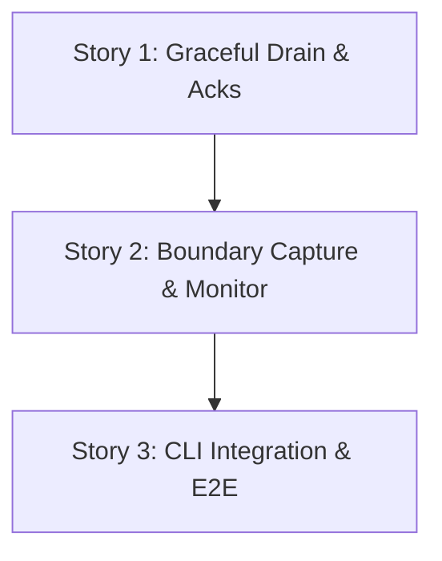

# Slice Summary: Slice 4 - Finish and Stop a Bulk Node Run

**Phase 2: Node Data Ingestion**

This slice delivers the bulk mode orchestration. The CLI orchestrator will use the Kafka AdminClient to monitor the consumer groups of the dynamically launched node loaders. It will capture the initial end offsets (bulk boundary), ensure all partitions have active consumers, wait for the committed offsets to catch up to the boundary, ensure the boundary does not move (quiescence), and then gracefully stop the container fleet.

---

## Story 1: Loader Lifecycle Acknowledgements and Graceful Drain

**As a** Pipeline Operator,
**I want** individual node loaders to explicitly acknowledge their partition assignments, handle graceful shutdown signals by flushing pending work, and confirm durable completion,
**So that** the orchestrator can securely track the state of every replica without guessing based on arbitrary timeouts.

### Technical Context
- **Graceful Shutdown**:
  - Update `src/loader/node_loader.py`. Use the `signal` module to catch `SIGTERM` (sent by `docker stop`).
  - Upon receiving `SIGTERM`, set a `_running = False` loop flag. The loader should break out of its `poll()` loop, call `self._flush_batch()`, and commit offsets before exiting 0.
- **Acknowledgement Protocol**:
  - To enable the orchestrator to track assignment and completion across distinct runs without state pollution from earlier executions, node loaders must report their status to an internal Kafka topic: `__graph_loader_control`.
  - The orchestrator will generate a unique `run_id` (e.g., UUID) and pass it to the loader via environment or CLI args.
  - Every control message published must contain this `run_id`, the `node_label`, a deterministic `replica_id` (derived from its container name), and the Kafka assignment epoch (if applicable).
  - On startup and after Kafka partition rebalance (`on_assign`), the loader synchronously publishes an `ASSIGNMENT` message detailing its `assigned_partitions`.
  - If it is a surplus replica (0 partitions assigned), it publishes an `IDLE_SURPLUS` message.
  - After receiving `SIGTERM` and successfully flushing/committing, it publishes a `DRAIN_COMPLETE` message.
  - **Crucial Safety**: Every control publish call must be explicitly acknowledged/flushed by Kafka before the loader proceeds (especially before exiting on `DRAIN_COMPLETE`).

### Acceptance Criteria
- [ ] Loader gracefully catches `SIGTERM`, flushes its partial batch, and commits.
- [ ] Loader reliably publishes its partition assignments or idle status via the control mechanism.
- [ ] Loader reliably publishes a drain completion acknowledgment after its final flush.

### Definition of Done
- [ ] Code written and committed.
- [ ] Tests pass with >80% coverage on new code.
- [ ] Technical docs / docstrings updated.
- [ ] Reviewed and merged.

### Dependencies
- Depends on: None
- Blocks: Story 2

### Estimated Points
Story points (Fibonacci): 5

---

## Story 2: Boundary Capture and Bulk Monitor Service

**As a** Pipeline Operator,
**I want** an orchestration service to capture the exact input boundary and track Kafka offsets and container health,
**So that** I know exactly when all required data has been durably processed.

### Technical Context
- Create `src/orchestrator/bulk_monitor.py` containing a `BulkMonitor` class.
- **Method `capture_boundary()`**:
  - Validates that every partition has an active consumer by collecting `ASSIGNMENT` and `IDLE_SURPLUS` acknowledgments from the `__graph_loader_control` topic.
  - Must filter control messages strictly by the active `run_id` and the latest assignment epoch (ignoring retained messages from older runs or stale assignments).
  - Proves partition coverage by ensuring the union of all valid `ASSIGNMENT.assigned_partitions` covers exactly every configured topic partition. `IDLE_SURPLUS` proves a replica safely owns no partitions, but does not satisfy partition coverage itself.
  - Once coverage is verified, uses `AdminClient` to fetch the high watermark (end offset) for all assigned partitions of every configured node topic.
  - Stores this mapping of `(topic, partition) -> end_offset`.
- **Method `wait_for_completion()`**:
  - Periodically checks current end offsets. If they increase beyond the captured boundary, raises `QuiescentViolationError`.
  - Monitors committed consumer group offsets via `AdminClient.list_consumer_group_offsets()`.
  - Actively polls container health (via `docker_service.list_node_loaders()` filtered by `run_id` or explicit container tracking). If any container crashes (exits with non-zero), immediately raises a `LoaderCrashError` specifying the affected `node_label`.
  - When committed offsets reach the boundary for all assigned partitions, returns successfully to signal the orchestrator to initiate the drain.

### Acceptance Criteria
- [ ] `BulkMonitor` accurately captures end offsets for all partitions.
- [ ] `BulkMonitor` correctly consumes the control topic to ensure all partitions are assigned or explicitly idle.
- [ ] Monitor detects and fails fast on container crashes with correct attribution.
- [ ] Monitor detects and fails on non-quiescent inputs (advancing end offsets).
- [ ] Missing or invalid offsets are retried/handled gracefully.

### Definition of Done
- [ ] Code written and committed.
- [ ] Tests pass with >80% coverage on new code.
- [ ] Technical docs / docstrings updated.
- [ ] Reviewed and merged.

### Dependencies
- Depends on: Story 1
- Blocks: Story 3

### Estimated Points
Story points (Fibonacci): 8

---

## Story 3: CLI Bulk Integration and End-to-End Verification

**As a** Pipeline Operator,
**I want** the CLI to orchestrate the full bulk run lifecycle and prove its correctness through end-to-end tests,
**So that** I can confidently run bulk loads in production.

### Technical Context
- Modify `src/cli.py` in the `handle_start` function for `bulk` mode:
  1. Generate a unique `run_id` (e.g. UUID) for the bulk fleet.
  2. Launch fleet via `DockerService`, supplying the `run_id` as an environment variable and a Docker container label (`run_id=<run_id>`). Track the exact started container objects locally.
  3. Instantiate `BulkMonitor` (passing the `run_id`).
  4. Wait for and validate `ASSIGNMENT` / `IDLE_SURPLUS` acknowledgements filtering by the `run_id`.
  5. Verify every configured topic partition is assigned exactly once.
  6. Capture the fixed boundary via `BulkMonitor.capture_boundary()`.
  7. Monitor committed offsets through the boundary via `BulkMonitor.wait_for_completion()`.
  8. Initiate graceful drain: signal only this run's containers (iterate over the tracked container objects and call `stop()`).
  9. Wait for `DRAIN_COMPLETE` acknowledgments from all assigned containers via the control topic.
  10. Post-drain verification: `BulkMonitor.verify_zero_lag()` to definitively confirm all partitions have exactly 0 lag.
  11. Wait for containers to exit and clean them up.
- Implement exhaustive End-to-End tests in `tests/test_bulk_e2e.py`:
  - **Happy Path:** Loads multiple configured node types, verifies expected Neo4j nodes with no duplicates, observes zero lag, and confirms containers exit.
  - **Empty Assignment:** Tests surplus replicas acknowledging idle state.
  - **Late Arrival:** Tests `QuiescentViolationError` by appending a record after the boundary is captured.

### Acceptance Criteria
- [ ] CLI correctly sequences boundary capture, wait, drain signal, drain wait, and final verification.
- [ ] Successful run yields exit code 0 and completely stopped containers.
- [ ] E2E tests fully satisfy the Slice 4 DoD requirements.

### Definition of Done
- [ ] Code written and committed.
- [ ] Tests pass with >80% coverage on new code.
- [ ] Technical docs / docstrings updated.
- [ ] Reviewed and merged.

### Dependencies
- Depends on: Story 2
- Blocks: None

### Estimated Points
Story points (Fibonacci): 8

---

## Story Map

## Total Estimate
- Total Points: 21
- This fits well within a standard 30-point sprint.
