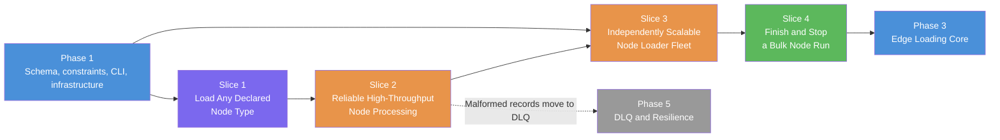

# Phase 2: Node Data Ingestion — Feature Slices

## Phase Summary

Phase 2 enables Data Engineers and pipeline operators to load every node type declared in the YAML graph schema from Kafka into Neo4j without writing entity-specific code. It delivers generic, idempotent node creation and updates, efficient batched writes, isolated loader containers that can scale independently, and a bulk-mode completion contract that drains work and stops the loader fleet when all node consumer groups have caught up. This phase depends on Phase 1's validated schema, online uniqueness constraints, local container environment, and CLI foundation; it blocks Phase 3 because relationships cannot be loaded safely until their endpoint nodes exist. If Phase 2 is skipped or implemented poorly, edge loads can encounter missing endpoints, replayed data can create duplicates, Kafka offsets can advance ahead of database durability, and bulk runs can report success while records remain buffered. Malformed node messages are deliberately logged and skipped in this phase; durable routing and retry through a DLQ is deferred to Phase 5 and must replace this temporary policy there.

---

## Slice 1: Load Any Schema-Declared Node Type

**As a** Data Engineer,
**I want** one generic node-loading capability to consume and upsert any node type declared in the YAML schema,
**So that** I can add or change node types through configuration without building a custom loader for each entity.

### Scope

**IN scope:**
- Consume JSON node messages from the Kafka topic associated with a selected YAML `NodeConfig`.
- Use the declared node label, `key_property`, and property definitions rather than hard-coded entity names.
- Define and document the canonical raw node-message contract: a JSON object with declared properties at the top level; required and key properties must be present and non-null, unknown fields are rejected, optional `null` properties are omitted, and declared `date`/`datetime` values are normalized for Neo4j.
- Create or update nodes with `MERGE` semantics based on the declared key property.
- Apply the declared record properties to the matched or newly created node.
- Support every node type in the loaded schema through the same generic behavior.
- Provide a direct, documented single-node-loader invocation for development and operation before fleet orchestration is added in Slice 3.
- Verify successful loading and replay behavior against Neo4j with representative schemas containing multiple node labels.

**OUT of scope:**
- Batched writes and transient-error retry behavior, which are delivered in Slice 2.
- Starting one loader container for every node type, which is delivered in Slice 3.
- Relationship ingestion, endpoint matching, and deadlock prevention, which begin in Phase 3.
- Runtime schema hot-reload.

### Definition of Done (DoD)

- [ ] A valid JSON message from a configured node topic creates a node with the configured label, key, and properties in Neo4j.
- [ ] The same loader behavior works for every node entry in the YAML schema without entity-specific code changes.
- [ ] Replaying a record with the same key updates the existing node and does not create a duplicate.
- [ ] Replaying an entire topic produces no duplicate nodes for any configured node label.
- [ ] The documented message contract is enforced for required, optional, unknown, `date`, and `datetime` properties.
- [ ] An operator can run one selected node loader through the documented interface and observe its configured topic reach Neo4j.
- [ ] Tests demonstrate generic ingestion for at least two node types with different labels, topics, keys, and property sets.

### Dependencies

- Depends on: Phase 1 — YAML Graph Schema Registry, Automated Schema Initializer, Base CLI, and local Kafka/Neo4j environment
- Blocks: Slice 2 (Reliable High-Throughput Node Processing)

### Rough Effort

T-shirt size: **M**

---

## Slice 2: Process Node Records Reliably at High Throughput

**As a** Data Engineer,
**I want** node records to be validated, buffered, and written in reliable batches,
**So that** large node datasets load quickly without losing acknowledged Kafka records or halting on malformed input.

### Scope

**IN scope:**
- Buffer valid records up to the configured `unwind_batch_size` and write each batch through one parameterized Neo4j `UNWIND` operation.
- Extend the schema-backed loading configuration with `unwind_batch_size` (and the bounded flush timing needed for partial batches), so batching is configurable rather than an undocumented runtime constant.
- Flush a non-full batch on a bounded idle interval and during graceful shutdown so low-volume and final records are not stranded.
- Disable Kafka auto-commit and commit only the highest contiguous, durably resolved offset for each Kafka partition after its corresponding Neo4j transaction succeeds.
- Retry Neo4j transient failures with bounded exponential backoff while retaining the batch and leaving its offsets uncommitted until the write succeeds.
- Validate consumed JSON sufficiently to identify malformed JSON, missing configured keys or required properties, and incompatible declared property values.
- Log and skip malformed records without failing valid records in the same polling cycle; logs identify the topic, partition, offset, node type, and rejection reason. A malformed record becomes committable only after its rejection has been durably recorded, and never permits a commit past an unresolved earlier offset in the same partition.
- Record in operator/developer documentation that log-and-skip is an interim Phase 2 policy and malformed records will move to durable DLQ routing and retry in Phase 5.
- Exercise batching, retry, offset ordering, partial flush, idempotency, and malformed-record behavior in automated tests.

**OUT of scope:**
- Publishing malformed or exhausted records to a DLQ, replaying them, or applying exponential-backoff DLQ retries; these are Phase 5 capabilities.
- The Phase 5 dual-thread Kafka heartbeat model and rebalance-safe in-flight transaction handling.
- Edge records and missing-endpoint handling.
- Performance tuning for relationship writes.

### Definition of Done (DoD)

- [ ] The loader writes a full batch when it reaches `unwind_batch_size` and never submits a larger batch.
- [ ] `unwind_batch_size` and partial-batch flush timing are validated loading settings with documented defaults.
- [ ] A partial final or idle batch is flushed without waiting indefinitely for more messages.
- [ ] Kafka offsets for a batch are committed only after its Neo4j transaction completes successfully.
- [ ] A retryable Neo4j failure is retried with bounded exponential backoff, and no affected offsets are committed before success.
- [ ] Malformed records are logged with traceable Kafka metadata and a reason, skipped without stopping subsequent valid ingestion, and are not sent to a DLQ in Phase 2.
- [ ] Every committed Kafka offset is the highest contiguous, durably resolved offset for its partition; interleaved valid and malformed records across multiple partitions cannot skip an unresolved record.
- [ ] Documentation explicitly tracks migration of malformed node records from logging to the Phase 5 DLQ workflow.
- [ ] Batch replay remains idempotent and creates no duplicate nodes.

### Dependencies

- Depends on: Slice 1 (Load Any Schema-Declared Node Type)
- Blocks: Slice 3 (Run an Independently Scalable Node Loader Fleet)

### Rough Effort

T-shirt size: **L**

---

## Slice 3: Run an Independently Scalable Node Loader Fleet

**As a** Pipeline Operator,
**I want** the CLI to launch an isolated loader for every node type in the YAML schema,
**So that** all foundational entities can load in parallel and each node workload can be operated and scaled independently.

### Scope

**IN scope:**
- Extend the Phase 1 CLI start workflow to discover all node definitions from the validated YAML schema.
- Build and version the executable node-loader image, including its node-loader command and entrypoint, as part of this slice; Phase 1 supplies the base CLI and local infrastructure, not this image.
- Launch one isolated Docker loader container for every declared node type, not just a fixed example entity.
- Support an optional, declarative replica count for each node type (default one) so a node workload can scale horizontally when its topic has partitions.
- Supply each container with the selected node label, Kafka topic, loading mode, Neo4j connection, Kafka connection, schema location, and deterministic consumer-group identity it needs. Replicas of one node type share that node type's group; groups are derived deterministically from the configured base group plus the node identifier and are isolated from other node types.
- Use predictable container naming and labels so each node loader can be discovered, inspected, and stopped by the orchestrator.
- Ensure a failure to launch one required node loader is surfaced as a failed start rather than a successful partial fleet.
- Preserve independent horizontal scaling of node consumers without changing node-ingestion code.
- Verify that adding another node definition to YAML causes the corresponding loader to be launched without code changes.

**OUT of scope:**
- Automatically determining that a bulk run is complete, which is delivered in Slice 4.
- Kubernetes, Docker Swarm, or cross-host scheduling.
- Edge-loader orchestration and conflict scheduling from Phases 3 and 4.
- Automatic per-node performance tuning or autoscaling policy.

### Definition of Done (DoD)

- [ ] With the default replica count, starting the pipeline launches exactly one discoverable node-loader container for each node type declared in the selected YAML schema.
- [ ] The node-loader image builds and exposes the documented command/entrypoint required to run a selected configured node type.
- [ ] Each container consumes only its assigned node topic and writes only its assigned node label.
- [ ] All declared node types can ingest concurrently without entity-specific container definitions or code branches.
- [ ] Container identities are deterministic and unique, while every replica of one node type shares only that node type's deterministic consumer group.
- [ ] Increasing a node type's declared replica count launches that number of workers without affecting another node type's consumer group or workers.
- [ ] Adding a new valid node definition to YAML results in a new correctly configured loader on the next start.
- [ ] A required container launch failure makes the start operation fail clearly and identifies the affected node type.

### Dependencies

- Depends on: Slice 2 (Reliable High-Throughput Node Processing) and Phase 1 — Base CLI and local Docker/Kafka/Neo4j infrastructure
- Blocks: Slice 4 (Finish and Stop a Bulk Node Run)

### Rough Effort

T-shirt size: **M**

---

## Slice 4: Finish and Stop a Bulk Node Run

**As a** Pipeline Operator,
**I want** bulk mode to detect when every node workload is durably complete and then stop its loader containers,
**So that** I receive a trustworthy completion signal and do not leave one-shot ingestion resources running.

### Scope

**IN scope:**
- Monitor Kafka consumer-group lag for every node loader started from the schema.
- Define a bulk input boundary only after every configured node consumer group has joined and every topic partition has an assigned live loader: capture the end offset for every assigned topic partition and require its owning loader to acknowledge durable processing through that boundary. An otherwise healthy surplus replica may explicitly acknowledge that it owns no partitions and does not block completion.
- Treat zero lag as a completion check only after the assigned-partition boundary and loader acknowledgements have been satisfied; zero lag by itself is not completion.
- Coordinate a graceful final drain so partial batches are written and their offsets committed before completion is declared.
- Reconfirm that all required node workloads are at zero lag after draining.
- Stop all node-loader containers automatically after successful bulk completion.
- Return a clear successful CLI result only after durable completion and container shutdown; surface loader, write, monitoring, or shutdown failures with the affected node type.
- Keep stream mode running continuously; automatic zero-lag completion and shutdown apply only to bulk mode.
- Require bulk inputs to be quiescent for the run. Records appended after the captured boundary produce a clear non-successful result rather than a silent successful completion; they belong to a subsequent bulk run or stream mode.

**OUT of scope:**
- Edge-loader scheduling or deciding when the edge phase begins.
- Global hash-bucket time slots and cross-loader coordination from Phase 4.
- Continuous-stream shutdown policies.
- DLQ drain completion, retry exhaustion, and rebalance-safe shutdown from Phase 5.
- Metrics dashboards and production alerting from Phase 6.

### Definition of Done (DoD)

- [ ] Bulk mode monitors every node consumer group derived from the YAML schema and does not succeed while any group has non-zero lag.
- [ ] Bulk mode captures an assigned-partition end-offset boundary and does not complete until every required partition has durably reached it; an expected consumer group with no assigned topic partitions cannot complete the run merely by reporting zero lag, while an explicitly idle surplus replica can complete its no-partition acknowledgement.
- [ ] Zero broker lag does not cause buffered or in-flight Neo4j records to be abandoned.
- [ ] Every loader performs a final batch flush and commits successful offsets before the run is declared complete.
- [ ] The orchestrator reconfirms zero lag after the final drain and stops every node-loader container it started.
- [ ] The CLI exits successfully only when all node groups are durably complete and all node-loader containers have stopped.
- [ ] A record appended after the bulk boundary cannot result in a silent success; the run reports that its quiescent-input contract was violated.
- [ ] Stream mode does not stop merely because current lag reaches zero.
- [ ] An end-to-end bulk test loads multiple configured node types, verifies the expected Neo4j nodes with no duplicates, observes zero lag, and confirms no node-loader containers remain running; separate tests cover empty assignments and late arrivals.

### Dependencies

- Depends on: Slice 3 (Run an Independently Scalable Node Loader Fleet)
- Blocks: Phase 3 — High-Throughput Edge Loading (Core)

### Rough Effort

T-shirt size: **L**

---

## Slice Map

**Execution order:** Phase 1 prerequisites → Slice 1 → Slice 2 → Slice 3 → Slice 4 → Phase 3. The malformed-record log-and-skip policy introduced in Slice 2 is explicitly superseded by Phase 5's durable DLQ and retry workflow.
