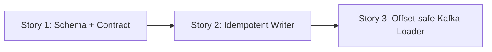

# Phase 3 / Slice 1: Load Any Declared Relationship Safely — Stories

## Slice Summary

This slice delivers a generic, sequential relationship ingestion path over the
Phase 2 durability primitives. It must work for any schema-declared edge, be
idempotent under replay, and never advance a Kafka offset before the Neo4j
relationship write is durable. Parallel relationship lanes, global lock
ordering, and cross-edge scheduling are deliberately deferred to Slices 2–4.

The canonical relationship event envelope is:

```json
{
  "source": {"<source-key-property>": "<source-id>"},
  "target": {"<target-key-property>": "<target-id>"},
  "properties": {"<declared-edge-property>": "<value>"}
}
```

Only schema-declared endpoint-key and relationship-property fields are accepted.
Missing endpoint nodes are an explicit, non-durable-write failure in this slice;
Phase 5 owns retry/DLQ policy for that condition.

## Story 1: Validate Relationship Endpoints and Event Contracts

**As a** Data Engineer,
**I want** schema-declared relationship endpoints and a canonical event contract
validated before ingestion,
**So that** a generic loader cannot attach an edge to the wrong node type or
silently accept malformed data.

### Technical Context

- Modify `src/models/schema.py`.
  - Extend `EdgeConfig` with `source_key_property: str` and
    `target_key_property: str`.
  - Add a `GraphSchema` model-level validator that resolves each edge's
    `nodes.source` / `nodes.target` labels to declared `NodeConfig` objects;
    require each configured endpoint key to exist, be required, and match that
    node configuration's `key_property`.
  - Validate that endpoint-key fields and relationship property fields remain
    Cypher-safe identifiers.
- Create `src/loader/edge_loader.py` with:
  - `EdgeRecordValidationError(ValueError)`.
  - `EdgeRecord` dataclass containing `source_key`, `target_key`, and
    normalized relationship properties.
  - `normalize_edge_record(raw_record: Mapping[str, object], edge_config:
    EdgeConfig) -> EdgeRecord`, which requires exactly `source`, `target`, and
    `properties` mappings; requires the configured endpoint keys; rejects
    undeclared properties; and reuses scalar normalization rules compatible
    with `PropertyConfig`.
- Keep the current Phase 2 rejection sink semantics separate from endpoint
  resolution: malformed envelopes are clear validation errors; missing endpoint
  handling belongs to the writer in Story 2.
- Modify `tests/test_schema_validation.py` and create
  `tests/test_edge_loader.py` for schema and pure-contract coverage.

### Acceptance Criteria

- [ ] Valid relationship declarations resolve source/target labels and their
  required key properties.
- [ ] Unknown endpoint labels, mismatched endpoint key properties, duplicate
  edge types, and malformed event envelopes fail with field-specific errors.
- [ ] The normalizer accepts two different edge declarations without
  type-specific branches.
- [ ] Unit tests cover valid, missing, null, unknown, and incorrectly typed
  endpoint/property values.

### Definition of Done

- [ ] Code, docstrings, and tests are written.
- [ ] New-code test coverage exceeds 80%.
- [ ] Reviewer approves the implementation.

### Dependencies

- Depends on: none.
- Blocks: Stories 2 and 3.

### Estimated Points

5

## Story 2: Write a Generic Idempotent Relationship Transaction

**As a** Data Engineer,
**I want** a schema-driven Neo4j writer that resolves two endpoints and merges
a relationship,
**So that** replaying a valid event never creates a duplicate edge.

### Technical Context

- Extend `src/loader/edge_loader.py` with:
  - `MissingRelationshipEndpointError(RuntimeError)`.
  - `build_edge_upsert_query(edge_config: EdgeConfig) -> str`.
  - `EdgeWriter(driver: Driver, edge_config: EdgeConfig)` with
    `write(record: EdgeRecord) -> None` and
    `write_batch(records: Sequence[EdgeRecord]) -> None`.
- Use parameterized identifiers derived only from validated schema fields. The
  sequential Slice 1 query is intentionally limited to endpoint resolution and
  idempotent merge; the APOC locking query below is reserved for Slice 3:

```cypher
UNWIND $rows AS row
MATCH (s:`<source-label>` {`<source-key>`: row.source_key})
MATCH (t:`<target-label>` {`<target-key>`: row.target_key})
MERGE (s)-[r:`<relationship-type>`]->(t)
SET r += row.properties
```

- Before committing, verify that each input row matched both endpoints. If a
  row cannot resolve both nodes, raise `MissingRelationshipEndpointError`; do
  not perform a partial merge and do not represent that transaction as durable.
- Reuse the Phase 2 pattern: context-managed Neo4j sessions and explicit
  transaction commit only after `consume()` succeeds.
- Test two configurations (for example `WORKS_AT` from `Person` to `Company`
  and `BOUGHT` from `Person` to `Product`), replay idempotency, unknown
  endpoints, Cypher identifiers, and transaction failures.

### Acceptance Criteria

- [ ] A valid event creates the configured relationship between exactly the
  configured endpoint labels.
- [ ] Replaying an event performs a `MERGE`, not a duplicate create.
- [ ] Relationship properties use the schema allowlist and normalized types.
- [ ] Missing source or target nodes fail before a durable relationship write.
- [ ] Writer tests cover two relationship types without type-specific code.

### Definition of Done

- [ ] Code, docstrings, and unit/integration-style driver tests are written.
- [ ] New-code test coverage exceeds 80%.
- [ ] Reviewer approves the implementation.

### Dependencies

- Depends on: Story 1.
- Blocks: Story 3.

### Estimated Points

8

## Story 3: Consume Relationship Topics With Durable Offsets

**As a** Pipeline Operator,
**I want** one relationship loader to consume a configured Kafka topic and
commit only after successful Neo4j edge writes,
**So that** restarts and replays preserve graph/Kafka consistency.

### Technical Context

- Complete `src/loader/edge_loader.py` with `EdgeLoader`, following the tested
  Phase 2 `NodeLoader` ordering:
  1. use `enable.auto.commit=False`;
  2. poll one record;
  3. decode and normalize the envelope;
  4. call `EdgeWriter.write`;
  5. commit the Kafka message synchronously only after the write is durable.
- Malformed JSON and schema-invalid events use the existing fsync-backed
  `RejectionSink` with topic, partition, offset, edge type, and reason before
  their contiguous offset can be resolved. Missing endpoints and Neo4j write
  failures remain uncommitted failures for this slice; Phase 5 introduces
  durable retry/DLQ behavior.
- Add a dedicated CLI entry point in `src/loader/edge_loader.py` analogous to
  `node_loader.py`: `--config`, `--edge-type`, `--topic`, `--mode`,
  `--replica-id`, and bounded `--max-messages` for tests. Resolve the requested
  `EdgeConfig` by type, create the Kafka consumer/producer, and close consumer
  and Neo4j driver in `finally`.
- Do not wire relationship containers into `src/cli.py` or
  `src/orchestrator/docker_service.py`; Slice 4 owns relationship-fleet
  scheduling.
- Add `tests/test_edge_loader.py` coverage for commit-after-write ordering,
  no commit after validation/write/missing-endpoint failure, durable rejection
  logging, replay safety, and consumer cleanup. Add a documented local command
  to `README.md`.

### Acceptance Criteria

- [ ] The loader consumes a configured edge topic and writes its declared
  relationship.
- [ ] No offset is committed before the relationship transaction is durable.
- [ ] Malformed events are durably recorded before their offsets are resolved.
- [ ] Neo4j/missing-endpoint failures leave the corresponding offset
  uncommitted.
- [ ] At least two declared edge types work through the same loader path.

### Definition of Done

- [ ] Code, operator documentation, and unit tests are written.
- [ ] Integration coverage demonstrates two declarations and replay without
  duplicate relationships.
- [ ] Reviewer approves the implementation.

### Dependencies

- Depends on: Stories 1 and 2.
- Blocks: Phase 3 Slice 2.

### Estimated Points

8

## Story Map



## Total Estimate

**21 points** — approximately one sprint at a 30-point capacity.

### Architecture Note

The Phase 3 business document calls for Neo4j `CALL { ... } IN CONCURRENT
TRANSACTIONS` with `DISJOINT BY`, whereas the canonical technical document
specifies Python-managed parallel lanes with APOC lock ordering. This conflict
does not affect Slice 1's sequential writer, but must be resolved before Slice
3 is charted or implemented.
