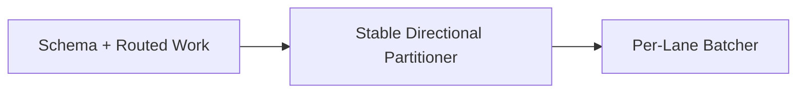

# Phase 3 / Slice 2: Route Relationship Work into Safe Mix-and-Batch Lanes

## Slice Summary

This slice adds deterministic, in-process lane assignment ahead of concurrent
writing. It preserves every Kafka source position with the routed record and
does not itself create threads, acquire Neo4j locks, write relationships, or
commit offsets. Those durability actions remain owned by the Slice 1 loader and
the Slice 3 concurrent executor.

## Story 1: Validate Lane Configuration and Routed Work Types

**As a** Data Engineer, **I want** every edge declaration to define a bounded
lane count, **so that** routing capacity is explicit and reproducible.

### Technical Context

- Modify `src/models/schema.py`: add `lane_count: int = Field(default=1, ge=1,
  le=4096)` to `MixAndBatchConfig`.
- Add `src/loader/mix_and_batch.py` with immutable `RoutedEdgeRecord` carrying
  `EdgeRecord`, topic, partition, offset, lane id, and direction; it must never
  own or mutate a Kafka consumer.
- Modify `tests/test_schema_validation.py`; create/extend
  `tests/test_mix_and_batch.py`.

### Acceptance Criteria

- [ ] Invalid lane counts fail schema loading clearly.
- [ ] Routed work preserves all Kafka acknowledgement metadata.

### Dependencies

Depends on: Slice 1. Blocks: Story 2. **Estimate: 3 points.**

## Story 2: Deterministically Partition Relationship Records

**As a** Data Engineer, **I want** stable source/target hash lanes and forward
or reverse directional separation, **so that** the same event is always routed
to one predictable safe work lane.

### Technical Context

- Implement `MixAndBatchPartitioner(edge_config: EdgeConfig)` and
  `route(record, *, topic, partition, offset) -> RoutedEdgeRecord` in
  `src/loader/mix_and_batch.py`.
- Use a process-independent BLAKE2b digest of a typed endpoint key value,
  modulo `lane_count`; never use Python's randomized `hash()`.
- Direction is `forward` when the canonical typed source token is less than or
  equal to target; otherwise `reverse`. Compute
  `lane_id = direction_bit * lane_count + source_bucket` so forward and reverse
  work cannot share a lane. Preserve the target bucket for diagnostics.
- Unit tests prove repeatability across instances, complete lane range,
  typed-token collision resistance, and opposite directions separated.

### Acceptance Criteria

- [ ] One valid record maps to exactly one stable lane.
- [ ] Reverse endpoint pairs use a distinct directional lane.
- [ ] No raw source/target values appear in logs or exceptions.

### Dependencies

Depends on: Story 1. Blocks: Story 3. **Estimate: 5 points.**

## Story 3: Buffer Per-Lane Batches Without Acknowledging Kafka

**As a** Pipeline Operator, **I want** routed work buffered independently by
lane, **so that** Slice 3 can schedule non-overlapping batches without losing
their original offsets.

### Technical Context

- Add `LaneBatcher` to `src/loader/mix_and_batch.py` with `add`,
  `drain_full`, `drain_expired`, and `drain_all`; per-lane FIFO ordering and
  `mix_and_batch.batch_size` control flushes.
- Inject a monotonic clock; no Kafka commit, Neo4j call, thread, or retry is
  permitted in this class.
- Test one super-node workload spreads into deterministic directional queues,
  lanes do not mingle records, batch boundaries retain offsets, and final drain
  returns every input exactly once.

### Acceptance Criteria

- [ ] Per-lane queues preserve records and Kafka metadata exactly once.
- [ ] Full, timed, and final drains are deterministic.
- [ ] The component cannot commit Kafka offsets.

### Dependencies

Depends on: Story 2. Blocks: Slice 3. **Estimate: 5 points.**

## Story Map

## Total Estimate

**13 points** — one small sprint. The later executor must choose the recorded
Phase 3 concurrency model before Slice 3 is charted.
