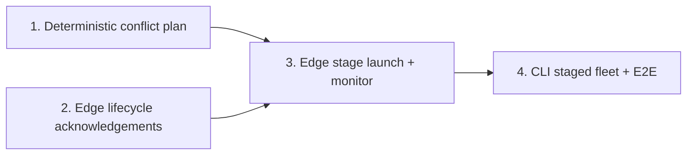

# Phase 3 / Slice 4: Run a Conflict-Aware Relationship Loader Fleet

## Slice Summary

This slice turns the completed single-type relationship loader into a finite,
run-scoped bulk fleet.  It schedules relationship types that share either
endpoint label in separate stages, while launching types with disjoint label
sets together.  A stage is successful only when its exact containers prove
their assignment, reach a fixed Kafka boundary, flush, acknowledge drain, and
exit before the next conflicting stage begins.

The existing `BulkMonitor` is node-specific (`node_label` and
`schema.nodes`), and `edge_loader.py` currently has no run-scoped control
protocol.  This slice therefore extends the *same* Phase 2 safety model to
edges rather than treating a zero-lag poll or container exit as evidence of a
durable stage.  Stream mode remains deliberately unscheduled.

## Story 1: Build a Deterministic Relationship Conflict Plan

**As a** Pipeline Operator,
**I want** declared relationship types converted into a deterministic conflict
graph and execution stages,
**So that** no two loaders that can contend for a node label overlap.

### Technical Context

- Create `src/orchestrator/dependency_manager.py` with immutable
  `RelationshipStage` and `RelationshipConflictPlan` value types, plus:

  ```python
  def build_relationship_conflict_plan(
      edges: Sequence[EdgeConfig],
  ) -> RelationshipConflictPlan:
      """Return deterministic, pairwise-label-disjoint bulk stages."""
  ```

- An edge's resource set is
  `{edge.nodes.source, edge.nodes.target}`.  Two distinct edge types conflict
  exactly when these sets intersect.  A self-referencing edge naturally has
  one resource and may share a stage only with an edge using neither label.
- Preserve all conflict-graph vertices, including isolated types.  Sort edge
  types lexicographically before applying a deterministic greedy stage
  assignment.  Within each stage sort type names, and expose an adjacency map
  whose values are immutable/frozenset-like.  Do not rely on YAML order or set
  iteration.
- Defensively reject duplicate type names even though `GraphSchema` already
  rejects them; this public planner must fail clearly when called directly.
- Create `tests/test_dependency_manager.py`.  Cover an empty plan, isolated
  types sharing a stage, `WORKS_AT(Person, Company)` conflicting with
  `BOUGHT(Person, Product)`, transitive chains, self-references, stable output
  under shuffled input, and the invariant that no two types in a stage share a
  label.

### Acceptance Criteria

- [ ] The plan exposes every configured relationship type and every expected
  conflict edge.
- [ ] Independent types are co-staged; types with a common endpoint label are
  never co-staged.
- [ ] Equivalent declarations always produce the same graph and stages.
- [ ] The planner is pure: no Docker, Kafka, Neo4j, or process side effect.

### Definition of Done

- [ ] Focused unit tests pass.
- [ ] Public types and invariants have docstrings.
- [ ] Reviewed and merged.

### Dependencies

Depends on: Slice 3. Blocks: Stories 3 and 4.

### Estimated Points

**5 points**

## Story 2: Give Edge Loaders the Run-Scoped Bulk Lifecycle

**As a** Pipeline Operator,
**I want** each relationship-loader replica to acknowledge assignment and
drain under a run-scoped identity,
**So that** a fleet stage has durable completion evidence rather than an
arbitrary sleep or a best-effort container stop.

### Technical Context

- Extend `src/loader/edge_loader.py` to accept `--run-id` and to create a
  Kafka `Producer` when bulk mode is run-scoped.  Add `producer`, `run_id`,
  and `replica_id` dependencies to `EdgeLoader` without changing its direct
  single-loader stream defaults.
- Mirror the proven NodeLoader protocol exactly, but identify the configured
  edge with `edge_type` (not `node_label`): `run_id`, `edge_type`,
  `replica_id`, `type`, `assignment_epoch`, and topic-qualified
  `assigned_partitions`.  Use `CONTROL_TOPIC` and key every event by
  `run_id`.
- Add private `_publish_control`, `_publish_pending_assignments`, and signal
  drain handling analogous to `NodeLoader`: an assignment callback queues an
  `ASSIGNMENT` or `IDLE_SURPLUS`; the main loop publishes it only after Kafka
  polling; `SIGTERM` stops polling, flushes the partial batch, verifies the
  contiguous commits, then synchronously publishes `DRAIN_COMPLETE`.
- A control delivery error, rebalance with unresolved work, write error, or
  failed final flush must return nonzero and must never publish
  `DRAIN_COMPLETE`.  `Producer.flush()` and its delivery callback must both
  confirm every lifecycle event before the loader proceeds/exits.
- Reuse `ControlDeliveryError` from `src.loader.node_loader` only if doing so
  does not create an import cycle; otherwise move that exception and shared
  payload/delivery helper into `src/loader/control.py` in a backwards
  compatible refactor.  Do not duplicate subtly different delivery rules.
- Extend `tests/test_edge_loader.py` with fake consumer/producer tests for
  assignment, idle surplus, epoch changes, graceful SIGTERM final flush,
  control delivery failure, and no drain acknowledgement on unsuccessful
  write/commit.

### Acceptance Criteria

- [ ] Every bulk edge replica emits durable, run-scoped assignment or idle
  proof before it consumes work.
- [ ] SIGTERM flushes valid buffered work and commits only its durable prefix
  before a durable drain acknowledgement.
- [ ] A failed write, commit, or control publish fails closed and emits no
  false completion.
- [ ] Existing direct edge-loader stream tests retain their behavior.

### Definition of Done

- [ ] Focused loader tests pass.
- [ ] Kafka auto-commit remains disabled.
- [ ] Lifecycle log messages identify only edge type, replica, topic,
  partition, and offset—not payload values.
- [ ] Reviewed and merged.

### Dependencies

Depends on: Slice 3. Blocks: Story 3.

### Estimated Points

**8 points**

## Story 3: Launch and Monitor One Relationship Bulk Stage

**As a** Pipeline Operator,
**I want** a run-scoped Docker relationship-loader stage with fixed-boundary
monitoring,
**So that** the orchestrator can safely determine when a concurrent stage has
finished.

### Technical Context

- Extend `src/orchestrator/docker_service.py` with `build_edge_image()` and
  `run_edge_loader(...) -> list[Container]`.  Create `Dockerfile.edge_loader`
  with the existing dependency/source layout and entrypoint
  `python -m src.loader.edge_loader`.
- The Docker method must use image `graph-loader-edge:latest`, bind the
  runtime schema and a per-edge rejection path, pass `--edge-type`, `--mode`,
  `--replica-id`, and `--run-id`, and label every exact container with
  `app=graph-loader`, `component=edge-loader`, `edge_type`, `replica_id`, and
  `run_id`.  Use the established hex-encoded run-id suffix so overlapping runs
  cannot collide.  Roll back only containers started by the failed call.
- Generalize `src/orchestrator/bulk_monitor.py` through a narrow
  `BulkWorkload`/`LoaderIdentity` abstraction, or add a parallel
  `RelationshipBulkMonitor` there that shares private safe primitives.  It
  must discover every topic partition, filter control messages by both
  `run_id` and `edge_type`, require exact assignment coverage once per stage,
  capture an end-offset boundary *after* coverage, reject watermark movement,
  compare the edge consumer-group committed offsets to that boundary, and
  verify post-drain zero lag.
- Container health must inspect the exact launched container objects, not a
  broad label search.  Errors must state the stage and affected `(edge_type,
  replica_id)` and distinguish launch, crash, assignment, offset, quiescence,
  and drain failures.
- Add `tests/test_docker_service.py` coverage for image, command, environment,
  labels, run-id collision safety, and rollback.  Add
  `tests/test_relationship_bulk_monitor.py` using mock AdminClient/Consumer
  and tracked containers for coverage, late arrival, missing offsets, exit
  attribution, and the rule that an old run or a different edge type cannot
  satisfy a stage.

### Acceptance Criteria

- [ ] Independent relationship loaders can be launched as one exact,
  run-scoped stage.
- [ ] The stage reaches completion only after all its partitions' committed
  offsets reach its captured boundary and all replicas durably drain.
- [ ] A stale control record, a late input record, or any replica crash fails
  the stage with affected edge/replica attribution.
- [ ] Cleanup never stops a container not returned from this stage launch.

### Definition of Done

- [ ] Unit tests cover Docker invocation and all monitor safety branches.
- [ ] The existing node `BulkMonitor` behavior remains covered and unchanged.
- [ ] Edge Docker image can start the correct module with Docker-network
  Kafka/Neo4j defaults.
- [ ] Reviewed and merged.

### Dependencies

Depends on: Stories 1 and 2. Blocks: Story 4.

### Estimated Points

**8 points**

## Story 4: Orchestrate Sequential Conflict Stages from the CLI

**As a** Pipeline Operator,
**I want** `start --mode bulk` to execute the planned relationship stages in
order and report their outcome,
**So that** a complete relationship bulk load uses every safe parallelism
opportunity without cross-loader lock contention.

### Technical Context

- Modify `src/cli.py` to retain the existing node bulk flow and, after it
  succeeds, run the relationship bulk flow only when `schema.edges` is
  non-empty.  Generate one relationship-fleet `run_id`, obtain the
  `RelationshipConflictPlan`, and log each deterministic stage as its ordered
  relationship type list.
- For each stage: launch all its configured edge types before beginning any
  monitor; create one stage monitor containing only that stage's expected
  replicas and exact container objects; await assignment coverage; capture
  boundary; await completion; stop only the stage's exact containers; await
  all `DRAIN_COMPLETE` acknowledgements; verify zero lag; then proceed to the
  next stage.
- On launch, monitor, write, or shutdown error, stop only live exact
  containers from the current stage, emit the stage and affected type(s), and
  return nonzero.  Never launch a later stage after an earlier stage failure.
  A `finally` path must close every monitor.  Stream-mode behavior remains the
  existing node-only open-ended fleet; do not silently schedule edge streams.
- Update `README.md` with a Phase 3 fleet command and canonical event example,
  explaining that relationship bulk starts only after successful node bulk and
  that each stage requires quiescent input.
- Extend `tests/test_cli.py` and add `tests/test_relationship_bulk_e2e.py`.
  Mock/unit tests must prove same-stage parallel launch for disjoint types,
  strict `WORKS_AT` then `BOUGHT` sequencing when both use `Person`, cleanup
  and attribution on every failure boundary, and no later launch after a
  failed stage.  The Docker-marked E2E test must create three node labels and
  both independent and conflicting relationship topics, publish a finite
  input, assert relationship counts/zero lag, and assert no edge-loader
  container remains after success.

### Acceptance Criteria

- [ ] The CLI launches all and only the types in an independent stage before
  it waits for that stage.
- [ ] No shared-label pair overlaps, and a dependent stage begins only after
  the preceding stage has drained and passed zero-lag verification.
- [ ] Failure output names the failed stage and relationship loader; no
  untracked or later-stage container is stopped/launched.
- [ ] The documented end-to-end case completes without deadlock and leaves no
  relationship loader running.

### Definition of Done

- [ ] Focused CLI and E2E tests pass (E2E may be Docker-marked for local CI).
- [ ] README operational guidance is updated.
- [ ] Full suite passes before final review.
- [ ] Reviewed and merged.

### Dependencies

Depends on: Story 3. Blocks: Phase 4.

### Estimated Points

**8 points**

## Story Map



## Total Estimate

**29 points** — approximately one sprint at the project's 30-point planning
capacity.  No story exceeds eight points.  First Mate should start with Story
1 because the pure plan gives the fleet orchestration a deterministic,
well-tested contract while the edge lifecycle protocol is built in parallel
only conceptually (implementation proceeds in story order).
