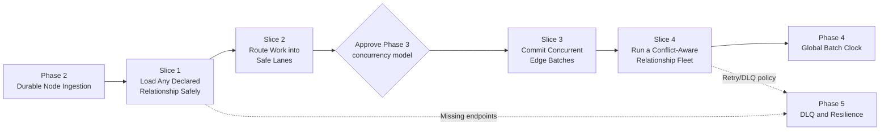

# Phase 3: High-Throughput Edge Loading (Core) — Feature Slices

## Phase Summary

Phase 3 enables Data Engineers to load schema-declared graph relationships from
Kafka at high volume without creating Neo4j deadlocks, including when many edges
share a super node. It builds on Phase 2's durable, quiescent bulk node loads: a
relationship loader must be generic, idempotent, offset-safe, and able to prove
that its endpoint nodes are present before it writes. The key risk is severe: a
naive concurrent relationship load can deadlock, stall a bulk job indefinitely,
or leave Kafka offsets ahead of the graph database. This phase therefore delivers
safe relationship ingestion, deterministic Mix-and-Batch isolation, ordered
database locking, and conflict-aware fleet scheduling. Durable missing-endpoint
retries and DLQ handling remain Phase 5 responsibilities.

> **Architecture decision before story planning:** `readme.md` requires Neo4j
> `CALL { ... } IN CONCURRENT TRANSACTIONS` with `DISJOINT BY`, while
> `technical.md` specifies Python-managed worker parallelism with a standard
> `UNWIND` transaction and APOC global lock ordering. Those are competing
> execution models. The slices below preserve the required observable safety and
> throughput outcomes, but Slice Cartographer must not select an implementation
> until this is resolved.

---

## Slice 1: Load Any Declared Relationship Safely

**As a** Data Engineer,
**I want** a generic loader to consume and upsert a relationship type declared
in the graph schema,
**So that** I can load connected data without writing one-off code per edge type.

### Scope

**IN scope:**

- Extend the YAML schema model with validated relationship declarations: Kafka
  topic, relationship type, source and target node labels, endpoint key fields,
  relationship properties, consumer-group identity, and replica configuration.
- Define and enforce a canonical relationship-message contract that identifies
  both endpoints and declared relationship properties.
- Consume one configured relationship topic, resolve its configured endpoints,
  and idempotently `MERGE` the declared relationship with its properties.
- Reuse Phase 2's durability boundary: no Kafka offset is committed before the
  corresponding relationship transaction succeeds.
- Produce operator documentation and automated tests for at least two distinct
  relationship declarations, including replay without duplicates.

**OUT of scope:**

- Parallel relationship workers, Mix-and-Batch lanes, and lock ordering, which
  are delivered in Slices 2 and 3.
- Scheduling more than one relationship loader, delivered in Slice 4.
- Durable retry or DLQ handling for missing endpoints, delivered in Phase 5.

### Definition of Done (DoD)

- [ ] A valid message for a configured relationship topic creates the declared
  relationship between the correct source and target nodes.
- [ ] The same implementation works for at least two relationship declarations
  with different types and endpoint labels, without type-specific code paths.
- [ ] Replaying a message does not create a duplicate relationship.
- [ ] No relationship offset is committed before the Neo4j write is durable.
- [ ] Invalid relationship configuration or message shape fails clearly without
  silently creating an incorrectly typed relationship.

### Dependencies

- Depends on: Phase 2 — Node Data Ingestion, including successful endpoint-node
  loads.
- Blocks: Slice 2 (Route Relationship Work into Safe Lanes).

### Rough Effort

T-shirt size: **L**

---

## Slice 2: Route Relationship Work into Safe Mix-and-Batch Lanes

**As a** Data Engineer,
**I want** each declared relationship stream deterministically split into
non-overlapping source/target hash lanes,
**So that** parallel workers do not contend for the same endpoint nodes.

### Scope

**IN scope:**

- Implement a deterministic Mix-and-Batch partitioner for configured
  relationship records using source and target hash buckets.
- Preserve directional separation for forward and reverse endpoint pairs so
  opposite-direction relationships cannot enter the same unsafe work lane.
- Dispatch accepted records to their assigned lanes while retaining source Kafka
  topic/partition/offset metadata for durable acknowledgement.
- Make lane count and batching settings validated, observable configuration.
- Test deterministic routing, full lane coverage, directional separation, and
  non-overlap for shared/super-node workloads.

**OUT of scope:**

- Neo4j global lock acquisition and concurrent database execution, which are
  delivered in Slice 3.
- Cross-relationship-type conflict scheduling, delivered in Slice 4.
- Global rotating bucket time slots, deferred to Phase 4.

### Definition of Done (DoD)

- [ ] The same relationship record always maps to the same configured lane.
- [ ] Every valid record maps to exactly one lane.
- [ ] Records that could contend on an endpoint are not scheduled concurrently
  in conflicting lanes under the selected Mix-and-Batch rule.
- [ ] Opposite-direction endpoint pairs are separated according to the
  documented directional rule.
- [ ] Lane assignment preserves enough Kafka metadata to commit only after its
  Neo4j work is known durable.

### Dependencies

- Depends on: Slice 1 (Load Any Declared Relationship Safely).
- Blocks: Slice 3 (Commit Concurrent Edge Batches Without Deadlocks).

### Rough Effort

T-shirt size: **L**

---

## Slice 3: Commit Concurrent Edge Batches Without Deadlocks

**As a** Pipeline Operator,
**I want** each safe relationship lane to write efficient batches with a global
endpoint lock order,
**So that** high-throughput relationship loading remains deadlock-free even
around super nodes.

### Scope

**IN scope:**

- Batch lane records into parameterized Neo4j writes.
- Resolve every batch's distinct endpoint nodes and acquire locks in ascending
  stable Neo4j internal-ID order through `apoc.lock.nodes()` before relationship
  `MERGE` operations.
- Execute independent lanes concurrently using the Phase 3 concurrency model
  selected by the recorded architecture decision, while retaining durable Kafka
  offset semantics.
- Demonstrate high-contention star and reverse-edge workloads without deadlock,
  duplicate relationships, or premature offset commits.
- Document the final concurrency model and its Neo4j/APOC prerequisites.

**OUT of scope:**

- Choosing between the competing Python-worker and `CALL IN CONCURRENT
  TRANSACTIONS` models; that architectural decision is a prerequisite to story
  planning for this slice.
- Coordinating independent relationship loader types, delivered in Slice 4.
- Time-sliced global coordination, deferred to Phase 4.

### Definition of Done (DoD)

- [ ] Every batch locks its distinct endpoint nodes in one globally stable order
  before it merges relationships.
- [ ] Independent safe lanes execute concurrently using the documented approved
  concurrency mechanism.
- [ ] A stress test with star-schema and opposing-edge traffic completes without
  Neo4j deadlocks or duplicate relationships.
- [ ] A failed batch leaves its Kafka offsets uncommitted until a durable retry
  or failure policy handles it.
- [ ] The selected implementation demonstrably satisfies the approved Neo4j
  concurrency acceptance criterion, including `DISJOINT BY` if that model wins.

### Dependencies

- Depends on: Slice 2 (Route Relationship Work into Safe Mix-and-Batch Lanes)
  and an approved Phase 3 concurrency decision.
- Blocks: Slice 4 (Run a Conflict-Aware Relationship Loader Fleet).

### Rough Effort

T-shirt size: **XL**

---

## Slice 4: Run a Conflict-Aware Relationship Loader Fleet

**As a** Pipeline Operator,
**I want** relationship loader types that share endpoint labels to run in a safe
sequence while independent types run together,
**So that** bulk relationship loads maximize safe throughput without
cross-loader lock contention.

### Scope

**IN scope:**

- Build a relationship conflict graph from validated YAML declarations, where
  relationship types conflict when they share a source or target node label.
- Derive deterministic conflict groups and bulk execution stages.
- Launch independent relationship loader types concurrently and wait for their
  bounded bulk completion; run conflicting stages one after another.
- Report the relationship types in each stage and accurately attribute launch,
  write, monitoring, or shutdown failure to the affected relationship loader.
- Test independent parallel execution and strict sequencing of conflicting
  relationship types such as `WORKS_AT` and `BOUGHT` sharing `Person`.

**OUT of scope:**

- Phase 4's Kafka global batch clock, rotating hash-bucket slots, and
  distributed multi-host coordination.
- Continuous-stream conflict scheduling policy.
- Missing-endpoint DLQ/retry workflows, delivered in Phase 5.

### Definition of Done (DoD)

- [ ] The orchestrator produces the expected conflict graph from declared
  relationship endpoints.
- [ ] Relationship types with no shared node labels are launched in the same
  bulk stage.
- [ ] Relationship types that share a node label never overlap in bulk mode.
- [ ] A completed stage is durably drained before a dependent conflicting stage
  begins.
- [ ] An end-to-end bulk scenario loads both independent and conflicting
  relationship types without deadlock and with no relationship loader left
  running after success.

### Dependencies

- Depends on: Slice 3 (Commit Concurrent Edge Batches Without Deadlocks) and
  Phase 2's run-scoped bulk lifecycle.
- Blocks: Phase 4 — Multi-Loader Concurrency (Global Batch Clock).

### Rough Effort

T-shirt size: **L**

---

## Slice Map

**Execution order:** Phase 2 → Slice 1 → Slice 2 → approve the concurrency
model → Slice 3 → Slice 4 → Phase 4. Phase 5 later adds durable handling for
edge records whose endpoint nodes are unavailable.
