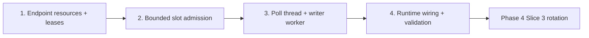

# Phase 4 / Slice 2: Gate Relationship Work by the Active Slot

## Slice Summary

This corrective slice makes the Slice 1 clock actionable for one relationship
loader without deciding how owners rotate across conflicting types (Slice 3)
or changing self-reference isolation (Slice 4).  The loader has one polling
thread that owns Kafka callbacks and clock messages, a bounded worker thread
that executes blocking Neo4j batches, and a contiguous offset ledger that can
advance only after durable writes.  Unleased work remains Kafka work: it is
bounded in memory, never committed early, and fails closed on unsafe state.

## Story 1: Derive Stable Endpoint Resources and Validate Current Leases

**As a** relationship loader,
**I want** stable configured endpoint bucket keys and a strict current-lease
state machine,
**So that** admission decisions are deterministic and never use stale,
foreign, malformed, duplicate, or expired clock data.

### Technical Context

- Modify `src/loader/mix_and_batch.py` to expose
  `endpoint_bucket(value: object, bucket_count: int) -> int` using existing
  `canonical_endpoint_token()`/BLAKE2b semantics, and add
  `EndpointBuckets(source: int, target: int)` plus
  `endpoint_buckets(record: EdgeRecord, bucket_count: int) -> EndpointBuckets`.
  Do not use Python's randomized `hash()` and do not alter directional lane
  routing.
- Create `src/loader/slot_admission.py` with `LeaseStateError`, frozen
  `ActiveSlotLease`, and `SlotAdmission`.  `SlotAdmission.accept_lease(payload,
  *, expected_run_id: str, now_ms: int) -> None` must call
  `decode_clock_lease()`, enforce strict monotonic `(epoch, slot_id)`, reject
  duplicate/conflicting same epoch and expired state, and retain only the
  current valid lease.  `owns(edge_type: str, buckets: EndpointBuckets,
  now_ms: int) -> bool` requires current, unexpired ownership of both endpoint
  buckets under the Slice 1 global bucket contract; a missing lease is false.
- Modify `src/models/schema.py` only if bounded admission/queue settings are
  absent; add immutable validated `slot_buffer_max_records` and
  `slot_worker_queue_max_batches` under `LoadingConfig` with positive,
  non-bool bounds.  Update `config/graph_schema.yaml` canonical defaults.
- Add `tests/test_slot_admission.py`, `tests/test_mix_and_batch.py`, and
  `tests/test_schema_validation.py` for typed deterministic buckets, foreign
  filtering, malformed/expired/stale/duplicate/conflicting lease rejection,
  both-endpoint ownership, and configuration bounds.

### Acceptance Criteria

- [ ] Same typed endpoints always produce the same configured bucket, and
  distinct typed representations remain distinguishable.
- [ ] A lease cannot be accepted unless it is valid, current, run-scoped, and
  has complete ownership for the configured bucket count.
- [ ] A record is eligible only with a current lease owned by its loader for
  both endpoint buckets.

### Definition of Done

- [ ] Focused pure unit tests pass.
- [ ] Errors contain run/edge/epoch/slot context but never raw Kafka payload.
- [ ] No Kafka, Docker, or Neo4j I/O is introduced in pure classes.

### Dependencies

- Depends on: approved Phase 4 / Slice 1.
- Blocks: Stories 2--4.

### Estimated Points

**8 points**

## Story 2: Buffer Unleased Records Without Premature Offset Resolution

**As a** relationship loader,
**I want** a bounded admission buffer for valid unleased records,
**So that** future-slot work waits safely instead of being written or committed
before its ownership lease arrives.

### Technical Context

- Modify `src/loader/edge_loader.py` to add a bounded `SlotAwareAdmissionBuffer`
  (or import it from `src/loader/slot_admission.py`) that retains
  `PendingEdgeRecord` in Kafka arrival order.  Add methods
  `admit_current_slot(now_ms: int) -> tuple[PendingEdgeRecord, ...]`,
  `add(pending, buckets)`, `fail_if_stale(now_ms)`, and `unresolved_partitions`.
  It must not mutate `PartitionLedger.resolved_offsets` for unleased valid
  records.
- Extend `EdgeLoader` constructor with a `SlotAdmission`, injected wall clock,
  and bounded buffer.  Add `_handle_coordination_message()`,
  `_route_admitted_records()`, and `_record_slot_context()`; consume the
  configured coordination topic with a separate consumer owned by the polling
  thread.  Invalid coordination for the active run or a current lease expiry
  is a fatal `stage=lease` failure naming edge, replica, slot/epoch if known.
- Preserve malformed-record behavior: only fsync'd rejection-sink entries may
  resolve an offset.  Preserve Phase 2/3 durable write behavior: no valid
  record resolves/commits until its write returns success.
- Fail closed before poll progress can outrun bounded memory: buffer overflow,
  stale lease with retained eligible work, revoke of buffered/unresolved work,
  or coordination-consumer failure returns nonzero and leaves valid offsets
  uncommitted.
- Extend `tests/test_edge_loader.py` and `tests/test_slot_admission.py` for
  withholding/release, out-of-order lease arrival, buffer saturation,
  expiry, revoked buffered work, malformed record logging, and contiguous
  no-premature-commit behavior.

### Acceptance Criteria

- [ ] Unleased valid records are neither written nor committed.
- [ ] A later valid lease releases only records owned by the active slot.
- [ ] Bounded buffer/revoke/lease failures preserve replayable Kafka offsets.
- [ ] Existing direct stream behavior remains compatible when slot gating is
  explicitly disabled for a non-fleet invocation.

### Definition of Done

- [ ] Focused admission/loader tests pass.
- [ ] Failure logs identify `stage=lease`, edge type, replica, and last
  epoch/slot when available.
- [ ] No DLQ/retry policy is added.

### Dependencies

- Depends on: Story 1.
- Blocks: Stories 3--4.

### Estimated Points

**8 points**

## Story 3: Separate Kafka Polling from Blocking Durable Writes

**As a** data engineer,
**I want** a poll/rebalance owner thread and a bounded write worker,
**So that** Kafka heartbeats continue while Neo4j transactions block without
compromising durable offset ordering.

### Technical Context

- Modify `src/loader/edge_loader.py` to introduce a typed
  `WorkerBatch`/`WorkerResult`, a bounded `queue.Queue`, and an owned worker
  `threading.Thread`.  The polling thread alone may call `Consumer.poll`,
  `assign`, `unassign`, `pause`, `resume`, and `commit`; the worker alone may
  call the existing lane batcher/coordinator and Neo4j writer.
- Add `EdgeLoader._start_worker()`, `_worker_loop()`, `_enqueue_admitted()`,
  `_drain_worker_results()`, `_stop_worker()`, and an explicit worker failure
  channel.  Results identify edge type, replica, topic/partition/offset range,
  epoch, and slot.  The polling thread marks records resolved and commits
  contiguous prefixes only after a successful result.  A worker exception,
  result mismatch, queue saturation, timeout, or shutdown before confirmation
  fails closed with `stage=worker` context.
- During blocking writes the poll thread must keep polling at a bounded
  interval below `max.poll.interval.ms`; it must also process coordination
  changes and refrain from queuing work after a lease becomes invalid.  A
  revoke with any queued, in-flight, buffered, or ledger-resolved-but-
  uncommitted record must fail closed and join the worker before release.
- The existing Cypher remains unchanged: `build_apoc_locked_upsert_query()`
  continues to lock distinct endpoint nodes in globally ordered `id(n)` order;
  no relationship-specific Cypher is introduced.
- Extend `tests/test_edge_loader.py` using blocking fake writers/events to
  prove heartbeat polls continue, writes do not commit early, worker failure
  blocks commits, queue saturation/revoke/shutdown fail closed, result order
  preserves each partition's contiguous ledger, and worker cleanup joins.

### Acceptance Criteria

- [ ] Kafka poll/rebalance ownership never crosses into the write worker.
- [ ] Polling continues while a write is intentionally blocked.
- [ ] A successful write is necessary but not sufficient for a commit: only
  the polling thread may commit its contiguous durable prefix.
- [ ] Worker/queue/rebalance/shutdown failures leave unresolved records
  replayable.

### Definition of Done

- [ ] Focused threading tests pass without timing sleeps where event barriers
  can prove behavior deterministically.
- [ ] Worker threads always terminate/join on all testable exits.
- [ ] Existing Phase 3 lane/lock semantics remain intact.

### Dependencies

- Depends on: Story 2.
- Blocks: Story 4.

### Estimated Points

**8 points**

## Story 4: Wire Fleet Runtime and Prove Slice 2 Safety End-to-End at the Unit Boundary

**As a** pipeline operator,
**I want** slot-gated loader containers to receive their coordination contract
and report attributed lifecycle failures,
**So that** Slice 3 can launch a shared fleet on a reliable foundation.

### Technical Context

- Modify `src/loader/edge_loader.py` parser/main to add opt-in
  `--coordination-topic` and `--slot-gating` arguments; create the coordination
  consumer with `enable.auto.commit=False`, a run-scoped group id distinct from
  the work group, and `auto.offset.reset=earliest`.  Direct one-edge commands
  keep their current default unless `--slot-gating` is supplied.
- Modify `src/orchestrator/docker_service.py` `run_edge_loader()` to pass
  Slice 1 coordination topic/config/run id and `--slot-gating` only for a
  clock-governed fleet.  Preserve existing hex run-id names, labels, per-
  replica rejection paths, and exact rollback.  Do not launch the clock or
  rotate owners here; that remains Slice 3.
- Modify `src/orchestrator/relationship_bulk_monitor.py` only to include
  edge/replica attribution supplied by loader lifecycle/control failures; do
  not change Phase 3's serial stage decision in this slice.
- Extend `tests/test_docker_service.py`, `tests/test_edge_loader.py`, and
  `tests/test_relationship_bulk_monitor.py` for CLI settings, isolated work/
  coordination groups, exact command/environment propagation, clock-consumer
  cleanup, malformed control handling, and failure messages.  Run the
  requested full non-Docker suite and `git diff --check`; Docker E2E is
  deliberately deferred to Slice 3 and must not be represented as completed.

### Acceptance Criteria

- [ ] A clock-governed loader uses the supplied run id and coordination topic
  while direct loader defaults do not regress.
- [ ] Work and coordination consumers do not auto-commit or share an unsafe
  group identity.
- [ ] Every shutdown closes both consumers and joins the worker; no tracked
  container outside the launch call is stopped.
- [ ] The non-Docker suite verifies all Slice 2 DoD safety rules.

### Definition of Done

- [ ] Focused tests and requested full non-Docker suite pass.
- [ ] `git diff --check` passes.
- [ ] Persistent reviewer approves every story and final integration review.
- [ ] `plan/v4/completion_slice-2.md` documents implementation and actual
  verification results; it does not claim a Docker E2E.

### Dependencies

- Depends on: Story 3.
- Blocks: Phase 4 / Slice 3.

### Estimated Points

**8 points**

## Story Map

## Total Estimate

**32 points** — approximately two sprints at 30 points per sprint.  First Mate
begins with Story 1.
