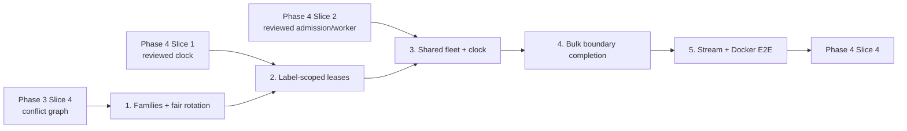

# Phase 4 / Slice 3: Rotate Shared-Label Loaders Without Starvation

## Slice Summary

Slice 3 replaces Phase 3's sequential relationship stages with one run-scoped
fleet for all eligible, non-self-referencing edge types.  A Kafka clock assigns
exclusive ownership of the **shared-label bucket resources** of each Phase 3
conflict family, rotates that ownership deterministically, and requires each
loader to process only records admitted by its current lease.  The existing
directional lanes, APOC/global lock ordering, contiguous offset ledger, and
exact-container cleanup remain mandatory.

### Prerequisite audit (2026-09-20)

- Phase 3 / Slice 4 has a completion report with reviewer sign-off and its
  conflict planner, exact-container monitor, and staged-fleet tests are present.
- Phase 4 / Slice 1 code and its three implementation plans are present in
  commit `1c16835`, including the protocol and `GlobalBatchClock`; however,
  there is no dedicated Slice 1 completion/reviewer-sign-off artifact. Its
  prerequisite status is therefore evidence-backed for code presence but not
  independently documented as reviewer-approved.
- Phase 4 / Slice 2 is complete and reviewer-approved in
  `plan/v4/completion_slice-2.md`, committed as `cd32017`. `EdgeLoader` now
  has a run-scoped coordination consumer, strict lease admission, bounded
  endpoint buffer, non-daemon writer worker, and poll-owner-only commits.
  Stories 2--5 may rely on those contracts.

## Architecture decision required before implementation

The current `ClockLease.bucket_owners: Mapping[int, str]` is global: it cannot
represent ownership of `Person` bucket 7 separately from `Company` or
`Product` bucket 7.  That makes it insufficient to model the stated
shared-label contract for `WORKS_AT(Person, Company)` and
`BOUGHT(Person, Product)`.  This cartography assumes the protocol is extended
to a canonical, label-scoped `shared_bucket_owners` map, keyed by every
conflicted `(label, bucket)` resource.  A loader may admit a record only when
it owns every conflicted endpoint resource required by that record; an
unshared endpoint never needs a lease.  The exact map shape must be approved
before Story 2.  If backward compatibility requires retaining
`bucket_owners`, it becomes a deprecated compatibility projection and must
never drive admission.

## Story 1: Derive Deterministic Conflict Families and a Fair Rotation Plan

**As a** pipeline operator,
**I want** the Phase 3 conflict graph reduced to stable conflict families and
bounded rotation schedules,
**So that** each contested label bucket has exactly one safe owner and every
active edge type receives it within a known number of epochs.

### Technical Context

- Modify `src/orchestrator/dependency_manager.py` to add frozen
  `ConflictFamily` and `SharedLabelResource` values plus
  `build_conflict_families(edges: Sequence[EdgeConfig]) -> tuple[ConflictFamily, ...]`.
  Reuse `build_relationship_conflict_plan()`'s immutable graph; do not rebuild
  conflicts from YAML order.  A family contains lexically sorted edge types,
  its shared endpoint labels, and an immutable edge-to-conflicted-label map.
- Create `src/orchestrator/rotation.py` with frozen `RotationPlan` and
  `build_rotation_plan(families: Sequence[ConflictFamily], bucket_count: int)
  -> RotationPlan`.  Its `owners_for_epoch(epoch: int) -> Mapping[str,
  Mapping[int, str]]` must use only canonical sorted family/type/label order.
  For every family and every conflicted `(label, bucket)`, it emits one owner;
  no two members may own the same resource in an epoch.  The schedule must
  prove a bound `max_wait_epochs <= len(family.edge_types)` for each family
  member and resource.  It must reject malformed/duplicate families, bool or
  out-of-range buckets, self-referencing types, and any schedule violating
  complete resource ownership.
- The allocator must preserve a record-admission invariant: a record can be
  made eligible only if its loader owns every conflicted endpoint resource it
  touches in that epoch.  When a graph has multi-label conflicts, use a
  deterministic compatible allocation (or reject a schedule that cannot make
  the required joint assignment); never silently admit a partial lease.
- Add `tests/test_dependency_manager.py` coverage for components, overlapping
  families, shuffle invariance, `WORKS_AT`/`BOUGHT` sharing `Person`, and a
  multi-label conflict.  Create `tests/test_rotation.py` with exhaustive small
  family/bucket simulations asserting exclusivity, deterministic replay,
  bounded fairness, invalid-plan rejection, and no self-reference inclusion.

### Acceptance Criteria

- [ ] Every Phase 3 conflict-graph vertex is in exactly one deterministic
  family, including isolated eligible types as singletons.
- [ ] No conflicted `(label, bucket)` has multiple owners in one epoch.
- [ ] Each family member receives every contested resource within the stated
  finite rotation bound.
- [ ] The planner performs no Kafka, Docker, Neo4j, or process I/O.

### Definition of Done

- [ ] Focused planner/simulation tests pass.
- [ ] Public invariants and failure messages identify family, label, bucket,
  edge type, and epoch where applicable.
- [ ] No code beyond pure planning and tests is changed.

### Dependencies

- Depends on: Phase 3 / Slice 4.
- Blocks: Stories 2--5.

### Estimated Points

**8 points**

## Story 2: Publish Label-Scoped Rotating Leases on the Shared Clock

**As a** relationship loader,
**I want** every accepted clock event to carry a durable, current, label-scoped
ownership assignment,
**So that** I can reject foreign, stale, conflicting, duplicate, malformed, or
expired leases before a write begins.

### Technical Context

- Modify `src/orchestrator/coordination.py`.  Extend frozen `ClockLease`,
  `encode_clock_lease()`, and `decode_clock_lease()` with canonical
  `shared_bucket_owners: Mapping[str, Mapping[int, str]]`; retain/retire the
  old global `bucket_owners` only through the approved compatibility policy.
  Validate complete bucket coverage for every conflict label, canonical type
  lists, family membership, bucket bounds from `CoordinationConfig`, and
  single-owner resource exclusivity.  Decode must validate before returning
  `None` for a valid foreign run and must not echo raw payloads.
- Extend `GlobalBatchClock` to accept `RotationPlan`, exact tracked clock
  container health probe, and the single fleet run id.  `publish_initial()`
  and `advance()` must derive the epoch's map from the plan; publish to
  `loading.coordination.topic` keyed by `run_id`; wait for exactly one
  successful delivery callback and `flush() == 0`; then expose the lease.
  Failed delivery, producer flush, invalid/receding wall time, expiry-before-
  renewal, health probe, or allocation must leave the prior epoch unchanged.
- Add a clock lifecycle event type (for example `CLOCK_FAILURE`) only if it is
  Kafka-acknowledged and keyed by the same run id.  Errors must name
  `stage=clock`, `run_id`, epoch, slot, affected family/edge where known; no
  payload contents may be logged.
- Extend `tests/test_coordination.py` for protocol upgrades, stale/duplicate
  epoch rejection, valid foreign filtering, malformed foreign rejection,
  expiry, producer failures, exact-health failures, and rotation publication.
  Extend `tests/test_rotation.py` to verify each emitted lease matches its
  plan exactly.

### Acceptance Criteria

- [ ] A valid current lease has one run id, increasing epoch, finite expiry,
  and a complete unambiguous label-scoped resource map.
- [ ] An acknowledgement failure never advances local clock state.
- [ ] Stale, duplicate, malformed, expired, foreign, and conflicting leases
  cannot become a loader's current ownership state.
- [ ] Existing Phase 3 lifecycle control messages remain separate from the
  coordination protocol and retain durable acknowledgement semantics.

### Definition of Done

- [ ] Focused protocol/clock tests pass.
- [ ] No broad Docker discovery is introduced; health uses only tracked clock
  objects.
- [ ] Error attribution includes clock epoch and slot.

### Dependencies

- Depends on: Story 1 and approved Phase 4 / Slice 1.
- Blocks: Stories 3--5.

### Estimated Points

**8 points**

## Story 3: Integrate the Rotation Clock with an Exact Relationship Fleet

**As a** pipeline operator,
**I want** all eligible loaders and their one clock to share one run identity,
**So that** concurrent loaders receive the same schedule and failures clean up
only the containers created for that run.

### Technical Context

- Modify `src/cli.py` to replace `_run_relationship_bulk_stages()` for
  non-self-referencing types with `_run_rotating_relationship_fleet(...)`.
  It builds one Phase 3 conflict plan, families, rotation plan, `run_id`, exact
  edge container map, and clock container/service before monitoring.  It
  passes the same `--run-id`, coordination topic/config, and group prefix to
  every `DockerService.run_edge_loader()` call.  Do not change Slice 4
  self-reference policy: reject/defer self-referencing types at this boundary.
- Modify `src/orchestrator/docker_service.py` to add
  `run_global_batch_clock(*, run_id, config_path, edge_types, network,
  tracked_edge_containers, ...) -> Container` and a dedicated
  `Dockerfile.clock` entry point (or an explicitly approved in-process clock
  alternative).  Label only created clock containers with
  `app=graph-loader`, `component=global-batch-clock`, `run_id`; use the
  existing hex run-id suffix and roll back only the objects returned by this
  launch attempt.  Add the clock's exact id to `GlobalBatchClock`'s health
  probe; never use broad `containers.list()` cleanup.
- Modify `src/orchestrator/relationship_bulk_monitor.py` to subscribe to the
  coordination topic as a separate consumer (or extend its existing control
  consumer safely).  It must filter by run id, validate epoch monotonicity,
  require an acknowledged current lease while bulk work is active, and report
  `stage`, edge type, replica, slot, and epoch on lease/worker/monitor failure.
  It must keep Phase 3 assignment/boundary/offset/drain proof intact.
- Extend `tests/test_cli.py`, `tests/test_docker_service.py`, and
  `tests/test_relationship_bulk_monitor.py` for all-type launch before
  monitoring, shared run id/config propagation, exact clock/edge cleanup,
  duplicate object rejection, launch rollback, and failure attribution.

### Acceptance Criteria

- [ ] Every eligible non-self-referencing type launches in one fleet, not
  sequential Phase 3 conflict stages.
- [ ] Clock and loaders share exactly one run id and configuration.
- [ ] Launch, clock, monitor, writer, and shutdown errors name their affected
  stage and type/replica/slot/epoch when known.
- [ ] Cleanup targets only explicit container objects from this fleet.

### Definition of Done

- [ ] Focused CLI/Docker/monitor tests pass.
- [ ] No Docker shell command or broad stop operation is introduced.
- [ ] Stream mode is not declared complete by this story.

### Dependencies

- Depends on: Story 2 and approved Phase 4 / Slice 2.
- Blocks: Stories 4--5.

### Estimated Points

**8 points**

## Story 4: Prove Bulk Rotation Drains Captured Boundaries Safely

**As a** pipeline operator,
**I want** bulk completion to wait across rotations until every captured edge
boundary is durably committed,
**So that** a temporarily unowned bucket is not mistaken for completed work.

### Technical Context

- Modify `src/orchestrator/relationship_bulk_monitor.py` to add
  `wait_for_rotating_completion(timeout_seconds: float)` and to retain the
  captured Phase 3 topic-partition end offsets until every edge group reaches
  them.  Zero lag while a loader has no current ownership is progress-neutral,
  not terminal.  The monitor must check the current non-expired lease before
  each completion/zero-lag decision and reject an advancing Kafka watermark
  after the boundary.
- Modify `src/cli.py` fleet shutdown order: capture all boundaries after exact
  assignment coverage and current lease evidence; wait for all boundary
  offsets across one or more rotations; stop only tracked edge/clock
  containers; wait for each edge `DRAIN_COMPLETE`; verify commits equal the
  captured boundaries and input remains quiescent.  On any error, perform the
  same exact-object cleanup and surface the first attribution-rich failure.
- Extend `tests/test_relationship_bulk_monitor.py` with fake leases and
  commits proving a non-owned zero-lag snapshot cannot finish bulk, completion
  after multiple epochs succeeds, stale/expired lease fails closed, watermark
  movement fails, and partial/late drain acknowledgements fail.  Extend
  `tests/test_cli.py` for shutdown ordering and no launch/monitor of later
  work after a failure.

### Acceptance Criteria

- [ ] Bulk completion is based on captured boundaries and durable commits, not
  process exit, instantaneous lag, or a single slot.
- [ ] Every bucket that was buffered because it lacked a lease gets a future
  ownership opportunity before timeout or an attributed failure.
- [ ] A failing clock, lease, monitor, writer, or shutdown leaves no claim of
  successful completion and preserves uncommitted Kafka work.
- [ ] Kafka offsets are committed only after the corresponding Neo4j writes
  completed durably.

### Definition of Done

- [ ] Focused monitor/CLI tests pass.
- [ ] Phase 2/3 contiguous offset and no-premature-commit tests still pass.
- [ ] Failure messages identify edge/replica and last slot/epoch when known.

### Dependencies

- Depends on: Story 3 and approved Phase 4 / Slice 2.
- Blocks: Story 5.

### Estimated Points

**8 points**

## Story 5: Keep Stream Fleets Live and Validate the Shared-Person Docker E2E

**As a** pipeline operator,
**I want** continuous fairness in stream mode and a real isolated Docker proof
of the `WORKS_AT`/`BOUGHT` conflict,
**So that** safe rotation is verified without treating an idle stream as done.

### Technical Context

- Modify `src/cli.py` so stream mode launches the rotating eligible fleet and
  clock but never runs bulk boundary capture, stop, drain, or terminal
  zero-lag logic.  Its monitor stays live and fails closed on clock/lease/
  worker failure; it reports fair ownership progress without terminating at
  zero lag.
- Create `tests/test_rotation_e2e.py`, marked `integration` and skipped only
  unless `RUN_ROTATING_RELATIONSHIP_E2E=1`.  The executable test must create
  unique finite Kafka topics and a temporary schema with `Person`, `Company`,
  `Product`, `WORKS_AT(Person, Company)`, and `BOUGHT(Person, Product)`;
  provision matching isolated Neo4j nodes; publish events covering multiple
  Person buckets; run the bulk CLI/fleet with a short rotation; then assert
  exactly-once relationship results, each type's group offsets equal its
  captured watermarks, evidence that both types held ownership/progressed over
  rotations, and zero exact-run edge/clock containers remaining.  It must not
  call a skipped placeholder an E2E test.
- Add unit coverage in `tests/test_cli.py`/`tests/test_relationship_bulk_monitor.py`
  that a stream zero-lag state remains non-terminal and that subsequent input
  is admitted only under a later valid lease.  The Docker test may run only
  after Docker Engine, Kafka, Neo4j, the `graph-loader-net` network, images,
  credentials, and user-approved Docker access are available.

### Acceptance Criteria

- [ ] `WORKS_AT` and `BOUGHT` both make bounded progress over a shared-Person
  rotation with no overlapping shared resource, deadlock, or duplicate edge.
- [ ] Stream mode remains alive at zero lag and reacts to later leased input.
- [ ] The opt-in Docker E2E provisions inputs, executes the fleet, verifies
  graph state, Kafka offsets/watermarks, rotation evidence, and exact cleanup.

### Definition of Done

- [ ] Focused non-Docker tests pass.
- [ ] The Docker E2E is documented as executed or unavailable with the actual
  reason; a skipped test is never reported as executed.
- [ ] Full requested non-Docker suite and `git diff --check` pass before final
  reviewer integration approval.

### Dependencies

- Depends on: Story 4 and approved Phase 4 / Slice 2.
- Blocks: Phase 4 / Slice 4.

### Estimated Points

**8 points**

## Story Map

## Total Estimate

**40 points** — approximately two sprints at 30 points per sprint.  First Mate
must not begin until Phase 4 Slice 2 is actually completed/reviewer-approved
and the label-scoped lease representation is approved.
