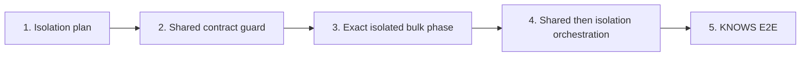

# Phase 4 / Slice 4: Keep Self-Referencing Relationships Absolutely Isolated

## Slice Summary

Slice 3 correctly excludes `SourceTargetConfig.is_self_referencing` types from
the shared clock. Slice 4 makes that exclusion an executable policy: a
`Person-KNOWS-Person` loader keeps Phase 3 directional lanes and globally
ordered APOC locking, but runs in an exact, clock-free isolated phase. Durable
Neo4j-before-Kafka-commit semantics and exact Docker ownership remain intact.

### Prerequisite audit

- Phase 3 Slice 4 supplies run-scoped edge lifecycle and durable bulk monitor.
- Phase 4 Slices 1–3 are committed as `1c16835`, `cd32017`, and `d77ba6a`.
- Current `src/cli.py`, `src/orchestrator/coordination.py`,
  `src/orchestrator/fleet_contract.py`, and `src/orchestrator/rotation.py`
  already fail closed when a self-reference enters the shared clock path.

## Story 1: Derive an Immutable Isolation Plan

**As a** pipeline operator,
**I want** every declared edge classified into a shared fleet or an isolated
self-reference phase,
**So that** no caller can schedule a dual-side edge under shared ownership.

### Technical Context

- Create `src/orchestrator/isolation.py`:

  ```python
  @dataclass(frozen=True)
  class IsolatedRelationshipPhase:
      index: int
      edge_type: str
      label: str

  @dataclass(frozen=True)
  class RelationshipIsolationPlan:
      shared_edge_types: tuple[str, ...]
      isolated_phases: tuple[IsolatedRelationshipPhase, ...]

  def build_relationship_isolation_plan(
      edges: Sequence[EdgeConfig],
  ) -> RelationshipIsolationPlan:
      """Return canonical shared types and one absolute phase per self edge."""
  ```

- Use only `edge.nodes.is_self_referencing`; do not let launch code infer from
  label equality. Sort type names lexically, reject duplicate or inconsistent
  public inputs, and represent every type exactly once. Each self-reference
  gets one sequential phase, even where labels differ, to honor “absolute”.
- Create `tests/test_isolation.py` for empty, shared-only, `KNOWS`-only,
  mixed `WORKS_AT`/`BOUGHT`/`KNOWS`, multiple self types, shuffled schemas,
  and validation errors. The planner is pure.

### Acceptance Criteria

- [ ] A self-reference never occurs in `shared_edge_types`.
- [ ] Every configured type occurs once, in deterministic order.
- [ ] No Kafka, Docker, Neo4j, or process I/O occurs.

### Definition of Done

- [ ] Focused planner tests pass with immutable value invariants.
- [ ] Errors identify edge type and label without payload contents.

### Dependencies

- Depends on: Phase 4 Slice 3.
- Blocks: Stories 2–5.

### Estimated Points

**5 points**

## Story 2: Harden the Shared Fleet Contract

**As a** clock and relationship loader,
**I want** shared-fleet contracts to contain exactly non-self-reference edges,
**So that** forged CLI/Docker/Kafka arguments cannot bypass isolation.

### Technical Context

- Modify `src/orchestrator/fleet_contract.py` with:

  ```python
  def select_shared_fleet_edges(
      edges: Sequence[EdgeConfig], fleet_types: tuple[str, ...],
  ) -> tuple[EdgeConfig, ...]:
      """Return exactly all and only isolation-plan shared edges."""
  ```

  It calls Story 1’s plan and retains canonical sorted/unique type validation.
  Keep `select_fleet_edges()` as a compatible alias or migrate all callers;
  there must be no permissive self-reference path.
- Modify `src/orchestrator/clock_runner.py`,
  `src/orchestrator/docker_service.py`, `src/loader/edge_loader.py`, and
  `src/orchestrator/coordination.py` only as needed to use the guarded shared
  selector. `GlobalBatchClock` retains direct self-reference rejection.
- Extend `tests/test_fleet_contract.py`, `tests/test_clock_runner.py`,
  `tests/test_docker_service.py`, `tests/test_edge_loader.py`, and
  `tests/test_coordination.py`. Forged contracts must fail before work polling,
  lease publication, or Docker launch with stage/run/type attribution.

### Acceptance Criteria

- [ ] A self-reference cannot enter the shared selector, slot-gated loader, or clock.
- [ ] No rejected request emits a lease, commits work, or launches a container.
- [ ] Slice 3 shared contracts remain compatible.

### Definition of Done

- [ ] Focused guard tests pass.
- [ ] Kafka auto-commit and Phase 3 durable offset rules are unchanged.

### Dependencies

- Depends on: Story 1.
- Blocks: Stories 3–5.

### Estimated Points

**8 points**

## Story 3: Run One Exact Isolated Bulk Phase

**As a** pipeline operator,
**I want** a self-reference type to use the existing durable edge lifecycle
without a coordination clock,
**So that** `KNOWS` drains safely before another phase starts.

### Technical Context

- Modify `src/cli.py` with:

  ```python
  def _run_isolated_relationship_bulk_phase(
      edge: EdgeConfig, docker_service: DockerService, args: argparse.Namespace,
      *, run_id: str, phase_index: int,
  ) -> int:
      """Launch, prove, drain, and clean up one self-reference-only phase."""
  ```

- Require `edge.nodes.is_self_referencing`; launch only its replicas through
  `DockerService.run_edge_loader(..., slot_gating=False, run_id=run_id)`.
  Do not create `GlobalBatchClock`, a rotation plan, coordination consumer, or
  `--fleet-edge-types` argument.
- Reuse `RelationshipBulkMonitor` without rotation dependencies: wait for
  exact assignment coverage, capture finite boundaries, wait for commits,
  stop only returned objects, await exact drains, and verify zero lag. Keep
  Phase 3 lane/lock Cypher unchanged.
- Errors name `stage=isolation`, run ID, phase, edge type, and replica where
  relevant. Roll back only returned containers after launch/monitor/shutdown
  failure.
- Extend `tests/test_cli.py`, `tests/test_docker_service.py`, and
  `tests/test_relationship_bulk_monitor.py` for no-clock launch, duplicate
  response rejection, exact cleanup, write failure/no commit, and drain failure.

### Acceptance Criteria

- [ ] One isolated phase starts one edge type and zero clock containers.
- [ ] Completion is the Phase 3 fixed-boundary, drain, and zero-lag proof.
- [ ] No broad Docker discovery/cleanup is introduced.

### Definition of Done

- [ ] Focused CLI/Docker/monitor tests pass.
- [ ] No new Cypher, retry, or DLQ policy is introduced.

### Dependencies

- Depends on: Stories 1–2 and Phase 3 Slice 4.
- Blocks: Stories 4–5.

### Estimated Points

**8 points**

## Story 4: Orchestrate Shared Then Isolated Phases

**As a** pipeline operator,
**I want** one deterministic bulk order for shared and self-reference work,
**So that** a clock-governed loader never writes an isolated label concurrently.

### Technical Context

- Modify `src/cli.py` so `handle_start()` derives one
  `RelationshipIsolationPlan` after node bulk success. Run the Slice 3 shared
  fleet first when `shared_edge_types` is nonempty, verify its exact clock and
  edges are gone, then invoke Story 3 phases lexically.
- Refactor `_run_rotating_relationship_fleet()` to receive the selected shared
  edge subset/plan. It returns success without a clock when no shared types
  exist, but direct self-reference membership still fails closed.
- Derive phase run IDs from the parent supplied/generated run ID and a
  collision-safe deterministic suffix. On any failure stop exactly live
  returned objects and never launch a later phase.
- **Stream policy needing product approval:** reject a mixed shared/self
  schema before relationship launch; allow exactly one self-reference-only
  stream type without slot gating, and reject multiple isolated stream types.
  A non-terminal stream cannot safely yield into a later absolute phase.
- Extend `tests/test_cli.py` for all-shared, only-self, mixed ordering,
  exact phase IDs, failure suppression, cleanup, and explicit stream policy.

### Acceptance Criteria

- [ ] Mixed bulk completes shared fleet cleanup before the first isolated launch.
- [ ] Isolated phases are one-at-a-time lexical order with no running shared clock.
- [ ] Failure has run/type/phase attribution and prevents later launch.

### Definition of Done

- [ ] Focused orchestration tests pass.
- [ ] Existing Slice 3 shared E2E remains passing.
- [ ] Approved stream policy is documented in code and README.

### Dependencies

- Depends on: Story 3.
- Blocks: Story 5 and Phase 5.

### Estimated Points

**8 points**

## Story 5: Prove `Person-KNOWS-Person` Isolation End to End

**As a** pipeline operator,
**I want** a real self-reference isolation acceptance test,
**So that** no deadlock, early commit, or stranded container crosses the phase boundary.

### Technical Context

- Create `tests/test_self_reference_isolation_e2e.py`, marked `integration`
  and skipped only unless `RUN_SELF_REFERENCE_ISOLATION_E2E=1`. Once enabled,
  Docker, `graph-loader-net`, Kafka, Neo4j, and exact images are required or
  fail diagnostically.
- Provision UUID-scoped Kafka topics and a config under
  `var/self-reference-e2e/<run>.yaml`; create tagged `Person` nodes and finite
  forward/backward `KNOWS` inputs. Use the public bulk CLI/fleet with explicit
  run ID. A mixed fixture additionally proves shared containers finish before
  `KNOWS` launch using exact returned objects only.
- Assert Neo4j relationship count/no duplicates, `KNOWS` committed offset
  equals watermark, no exact `graph-loader-edge-KNOWS-<replica>-<hex-run-id>`
  remains, and no clock was launched for an isolated-only run. Finally remove
  only precomputed topics, tagged nodes, config, and exact containers.
- Update `README.md` with bulk isolation and the approved stream restriction.

### Acceptance Criteria

- [ ] Opted-in test provisions inputs, executes fleet, verifies graph, offsets,
  ordering/isolation, and exact cleanup.
- [ ] It uses existing Phase 3 directional lanes/APOC locks; no type-specific Cypher.
- [ ] Opted-in unavailable infrastructure fails; it is never called a pass by skip.

### Definition of Done

- [ ] Focused tests, actual Docker E2E when available, full non-Docker suite,
  and `git diff --check` pass.
- [ ] Persistent reviewer approves final integration and completion report.

### Dependencies

- Depends on: Stories 1–4.
- Blocks: Phase 5.

### Estimated Points

**8 points**

## Story Map



## Total Estimate

**37 points** — about 1.25 sprints at 30 points/sprint. No story exceeds
eight points. First Mate should start with Story 1.

## Product decision required before implementation

Confirm the proposed stream policy: reject mixed shared/self-reference stream
schemas before relationship launch; permit a self-reference-only stream only
when it has exactly one isolated type. The current non-terminal stream
lifecycle has no safe automatic phase handoff.
