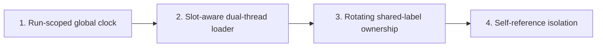

# Phase 4: Multi-Loader Concurrency — Feature Slices

## Phase Summary

Phase 4 removes the Phase 3 requirement to serially run relationship types
that share endpoint labels. A run-scoped Kafka coordination clock assigns
non-overlapping endpoint hash buckets to conflicting loaders in bounded slots,
then rotates ownership so all types make progress. This preserves the Phase 3
directional lanes, ordered locks, durable offsets, and exact-container
lifecycle while improving concurrent bulk and stream throughput. Self-
referencing types remain deliberately isolated because they can contend on
both sides of one relationship.

## Slice 1: Establish a Run-Scoped Global Batch Clock

**As a** Pipeline Operator,
**I want** a durable coordination clock that broadcasts bounded slot leases,
**So that** every relationship loader can make the same ownership decision.

### Scope

**IN scope:**

- Declare validated global-clock settings in YAML: bucket count, slot duration,
  coordination topic, and bounded missed-heartbeat/lease timeout.
- Create a run-scoped `graph.loader.coordination` protocol carrying clock epoch,
  slot id, active relationship types, bucket-owner assignments, and expiry.
- Implement a clock service that publishes a durably acknowledged initial slot,
  advances monotonically, and fails closed if Kafka acknowledgement or its
  Docker heartbeat check fails.
- Add unit tests for configuration, protocol validation, epoch monotonicity,
  lease expiry, and stale/foreign run filtering.

**OUT of scope:** Loader gating and Kafka worker threading (Slice 2); rotating
conflicting owners (Slice 3); self-reference isolation (Slice 4).

### Definition of Done

- [ ] Every valid clock message is attributable to exactly one run and epoch.
- [ ] A missed or expired lease cannot be treated as a current slot.
- [ ] The clock never silently advances after an undelivered coordination event.
- [ ] Clock configuration and protocol behavior are unit tested.

### Dependencies

Depends on: Phase 3 Slice 4. Blocks: Slices 2–4.

### Rough Effort

**L**

## Slice 2: Gate Relationship Work by the Active Slot

**As a** Data Engineer,
**I want** relationship loaders to admit only work belonging to their active
bucket lease while maintaining Kafka heartbeats,
**So that** concurrent loaders do not contend for the same node buckets.

### Scope

**IN scope:**

- Derive stable configured endpoint bucket keys compatible with Phase 3's
  typed directional routing.
- Add a slot-aware admission buffer: current-slot records proceed to existing
  lane batching; records for future/non-owned slots remain bounded and
  uncommitted.
- Introduce the dual-thread consumer model: one thread owns poll/rebalance and
  coordination messages; a bounded worker queue performs blocking Neo4j
  batches without violating Kafka `max.poll.interval.ms`.
- Preserve contiguous offset resolution and fail closed on queue saturation,
  revoked unresolved work, stale lease, worker failure, or shutdown.
- Test slot admission, buffering/release, heartbeat polling during blocked
  writes, and no premature commit.

**OUT of scope:** Clock publication (Slice 1), cross-type ownership rotation
(Slice 3), and self-reference policy (Slice 4).

### Definition of Done

- [ ] A record is written only while its endpoint bucket is leased to its loader.
- [ ] Ineligible records remain durable Kafka work and are not committed early.
- [ ] Kafka polling continues while worker writes block.
- [ ] Queue/worker/rebalance failures preserve the Phase 3 offset safety rule.

### Dependencies

Depends on: Slice 1 and Phase 3 Slice 3. Blocks: Slices 3–4.

### Rough Effort

**XL**

## Slice 3: Rotate Shared-Label Loaders Without Starvation

**As a** Pipeline Operator,
**I want** conflicting relationship types to receive rotating, non-overlapping
bucket ownership under one clock,
**So that** they run simultaneously with safe throughput and fair progress.

### Scope

**IN scope:**

- Build conflict families from the Phase 3 relationship conflict graph.
- Assign each shared-label bucket to at most one type per slot; rotate a
  deterministic ownership permutation at every clock epoch.
- Launch all eligible non-self-referencing relationship types in one fleet,
  propagate the same run id/clock configuration, and attribute lease, launch,
  writer, monitor, or shutdown failures to a type and slot.
- In bulk mode, prove all captured boundaries drain across clock rotations;
  in stream mode, expose continuous fair ownership without treating zero lag
  as terminal.
- Add conflict-family simulation tests and a Docker E2E scenario with
  `WORKS_AT` and `BOUGHT` sharing `Person` that both progress over rotations
  without deadlock.

**OUT of scope:** Self-referencing relationship types (Slice 4), DLQ/retry
policy (Phase 5), and observability dashboards (Phase 6).

### Definition of Done

- [ ] Conflicting loaders never hold the same shared endpoint bucket in one slot.
- [ ] Each active conflicting type receives ownership within a bounded rotation.
- [ ] Bulk completion reaches captured boundaries without serial type stages.
- [ ] A conflict E2E run has no deadlock, duplicate relationship, or leftover fleet.

### Dependencies

Depends on: Slices 1–2 and Phase 3 Slice 4. Blocks: Slice 4.

### Rough Effort

**XL**

## Slice 4: Keep Self-Referencing Relationships Absolutely Isolated

**As a** Pipeline Operator,
**I want** self-referencing relationship types excluded from shared clock
ownership,
**So that** dual-side endpoint contention never defeats the global schedule.

### Scope

**IN scope:**

- Use `SourceTargetConfig.is_self_referencing` to classify a type at planning,
  clock, and fleet launch boundaries.
- Reserve an isolation phase/lease in which no conflicting clock-governed loader
  can write the same label while a self-reference type is active.
- Reuse Phase 3 directional lanes and globally ordered locks inside the isolated
  loader; do not introduce type-specific Cypher.
- Test self-reference classification, rejection of mixed shared-slot assignment,
  deterministic isolated sequencing, and `Person-KNOWS-Person` bulk E2E.

**OUT of scope:** Missing-endpoint recovery and DLQ (Phase 5) and metrics/
alerting products (Phase 6).

### Definition of Done

- [ ] A self-referencing type is never assigned a shared-label clock slot.
- [ ] No clock-governed conflicting loader writes its label during isolation.
- [ ] The isolated load keeps durable offsets and terminates/drains cleanly.
- [ ] E2E verifies `KNOWS` isolation without deadlock or a stranded container.

### Dependencies

Depends on: Slices 1–3. Blocks: Phase 5.

### Rough Effort

**L**

## Slice Map

